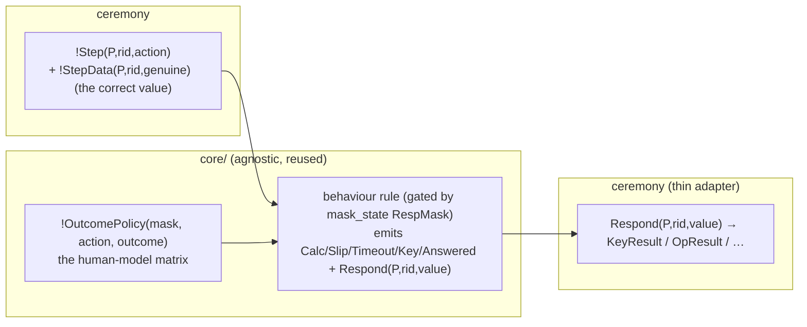

# Agnostic masks (response layer) — design

**Status:** ✅ **IMPLEMENTED** (2026-06-30). Roadmap item #1. All seven action classes migrated (compute,
compare, confirm, decide, authorize, share, set-policy); `core/masks/` went from 22 per-(mask×action) files
to 10 (one behaviour file per class + `outcome_policy` + 3 compare/share effect adapters). Every mask reads
the agnostic `!Step` interface; all 56 lemma checks green. §4 below was the pilot plan; it generalised
cleanly to every class.
**Companion:** mirrors [`AGNOSTIC_STRESSOR_INTERFACE.md`](AGNOSTIC_STRESSOR_INTERFACE.md) on the *other*
half of the human layer. That doc made the **detectors** (`f_U`) ceremony-agnostic; this one is about the
**masks** (`f_H`, the human's *response*). Goal (ROADMAP §Tier-1.1): collapse the per-action mask files
so a new ceremony adds zero `core/` files — the whole human layer becomes a single `#include` + the
`!Step` annotations.

## 1. Why masks are NOT a mechanical mirror of the stressor migration

A stressor only emits `SetMask` + an onset event — uniform, so reading a generic `!Step` was a clean
swap. A mask is different: it **produces the protocol fact that is the human's response**, and that fact
is irreducibly ceremony-specific. Compare the compute cluster:

| | input read | output produced | "correct" value |
|---|---|---|---|
| `Calc_*` (alex_blake real protocol) | `!Req(P,_,'CALC_SK',<Na,Nb>,_)` | `KeyResult(P,rid,·)` | `kdf(Na,Nb)` |
| `Op_*` (P4 infer_harness) | `!Op(P,_,op,m)` | `OpResult(P,rid,·)` | `m` |

The **behaviour** is identical — `Attentive`→correct, `Busy`→slip (fresh wrong term), `Careless`→timeout
— and the **action facts** are identical (`Calc(P,mask)`, `RespMask(P,mask)`, `Slip`/`Timeout`,
`Key(P,·)`, `Answered(rid)`). Only the input/output/value differ. So the masks already split into:

- **(A) behaviour** — which outcome a (mask, action-class) produces, and the common action facts. This
  is the reusable human-model knowledge; today it is *duplicated* across `Calc_*`/`Op_*` (and across
  ceremonies: `*_share` re-encodes the same thing for the password step).
- **(B) effect** — wrapping the outcome's value in the ceremony's protocol fact. Irreducibly
  ceremony-specific (a `KeyResult`, an `OpResult`, a `!Approved`, an `Accept`).

The migration separates (A) into `core/`, leaving only thin (B) adapters per ceremony.

## 2. Design — behaviour policy + Respond event + thin effect adapters

Three pieces, parallel to the stressor side's Layer-1/2/3:

- **`!OutcomePolicy(mask, action, outcome)`** — a small seeded table (like the stressor lexicon) holding
  the human-model matrix: `('Attentive',action,'correct')`, `('Busy','compute','slip')`,
  `('Careless','compute','timeout')`, `('Naive','compare','mistake')`, `('Habituated','confirm','auto')`,
  `('Fearful','authorize','abort')`, … This is where the behaviour knowledge lives, once.
- **Behaviour rules (core/, one per outcome class)** read `!Step` + `!OutcomePolicy(mask,action,outcome)`,
  bind `mask` from the policy, emit `RespMask(P,mask)` (gated by `mask_state.spthy` exactly as today, so
  only the active mask fires) plus the common action facts, and put the response *value* into a generic
  `Respond(P,rid,value)`. The "correct" value comes from `!StepData`; a slip mints `Fr(~wrong)`; a
  timeout/abort emits no `Respond`.
- **Effect adapters (ceremony, thin)** read `Respond(P,rid,value)` and wrap it in the ceremony's fact:
  `[ Respond(P,rid,v) ] -> [ KeyResult(P,rid,v) ]`. One per distinct output fact. A ceremony reusing a
  standard action+output writes one adapter line instead of N mask files.

**Why `!StepData` (the genuine value) is needed:** the behaviour rule cannot compute `kdf(Na,Nb)` — that
is ceremony content. So the producer that already knows the correct result emits it alongside `!Step`.
(Kept as a *separate* fact, not a 4th `!Step` argument, so the stressor detectors' `!Step(P,sid,action)`
pattern is untouched.)

## 3. What stays exactly as-is

- **`mask_state.spthy` gating.** Behaviour rules emit `RespMask(P,mask)`; the existing
  `RespondDegradedRequiresActive` / `AttentiveRequiresNoActiveDegrade` restrictions decide which mask is
  allowed. The mask-selection mechanism is unchanged — we only move where `RespMask` is emitted from.
- **The action-fact vocabulary** the lemmas read (`Calc`, `Slip`, `Timeout`, `Key`, `Mask`, `!Failed`,
  `AutoApprove`, `Accept`, `Mistake`, …) — the behaviour rules and adapters emit the same facts, so
  lemmas are untouched.
- **The stressor side** (detectors, lexicon, `!Step` emission) — unchanged.

## 4. Pilot: the compute cluster

Smallest validating slice — collapse `Calc_*` + `Op_*` (6 files) into the agnostic compute behaviour:

1. `core/masks/outcome_policy.spthy` — seed the compute rows (`Attentive→correct`, `Busy→slip`,
   `Careless→timeout`), unconditional + persistent (closed theory, no sources loop).
2. `core/masks/compute_behavior.spthy` — the three behaviour rules (correct/slip/timeout) reading
   `!Step(_,_,'compute')` + `!StepData` + `!OutcomePolicy`, gated by `RespMask`.
3. Ceremony producers emit `!StepData(P,rid,genuine)`: `msg3_request` / `msg3_request_confirmed` /
   `blake_calc_stressable` → `kdf(Na,Nb)`; `infer_harness` `Pose_kdf` → `kdf(~Na,Nb)`.
4. Effect adapters: alex_blake `KeyResult` adapter (P1/P3/P6) and `OpResult` adapter (P4).
5. Delete the 6 `Calc_*`/`Op_*` files; rewire `calc_phase`, P4, P6 includes; re-prove all 56 checks.

If green, roll to compare (`*_verify` + `*_verify_op` → one), confirm/approve, decide, authorize, and the
`*_share` masks (whose `Careless→leak` / `Busy→misdeliver` outcomes show the policy matrix is
action-dependent — exactly what the `!OutcomePolicy` table is for).

## 5. Risks to watch

- **Per-outcome `!Failed` divergence.** `busy_calc` omits `!Failed`; `busy_op` emits it (σ₁₀ chaining).
  Unifying emits it on every compute slip — harmless where no σ₁₀ reads it (P1/P3), but re-prove confirms.
- **`Respond` / adapter linkage.** `Respond(P,rid,·)` and the request share `rid`; the adapter must not
  double-`Answered` (keep `Answered` in the behaviour rule only).
- **Partial deconstructions** from the new `Respond`/`!StepData` reads — budget a `sources` pass; P3 is
  the blow-up canary.
- **Adapter coverage.** A theory must include exactly the adapters for the outputs it uses, or `Respond`
  is produced-but-unconsumed (wellformedness) / a needed fact is missing (not closed).
