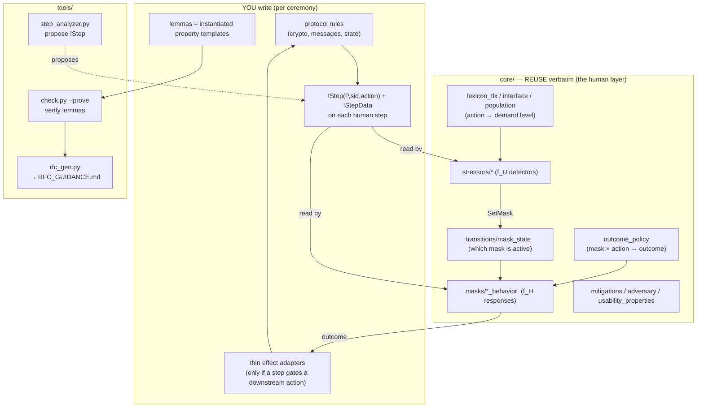
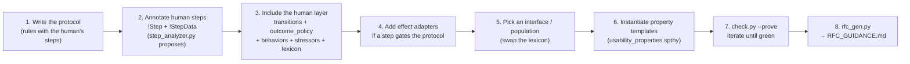
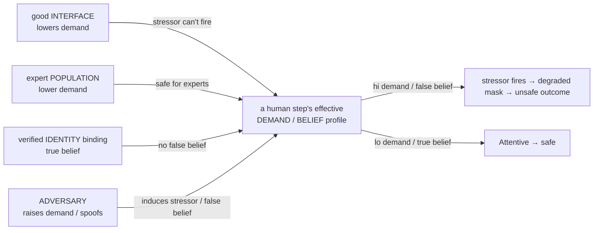
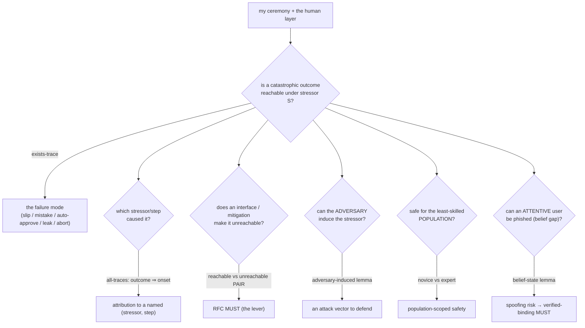
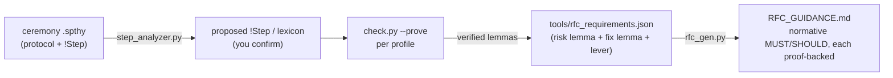

# Modeling a new ceremony — authoring guide

This is the **start-here** guide: how to take a ceremony (your protocol + the human steps in it) and use
the core elements and tools to get **machine-checked usability-security findings** and **RFC-ready
requirements**. It ties together the deeper docs — [`AGNOSTIC_STRESSOR_INTERFACE.md`](docs/AGNOSTIC_STRESSOR_INTERFACE.md)
(how stressors are collected), [`AGNOSTIC_MASKS.md`](docs/AGNOSTIC_MASKS.md) (how the human responds),
[`STRESSORS.md`](STRESSORS.md), [`CALIBRATION.md`](docs/CALIBRATION.md), [`TERMINATION.md`](TERMINATION.md),
[`INCIDENTS.md`](docs/INCIDENTS.md).

## 1. The picture

You write only the **protocol** and the **`!Step` annotations**. The reusable **human layer** (`core/`)
degrades the human under usability problems; **levers** (interface / population / adversary / identity)
shift the same demand profile; the **tools** turn the proofs into requirements.

> **The layered template (V3).** Both shipped ceremonies use one directory shape — copy it for a new
> ceremony and swap the protocol:
> ```
> <ceremony>/
> ├── <X>0_baseline.spthy … <X>N.spthy    # profile entry points (includes only)
> ├── protocol/    🔵 crypto + setup/exchange over real channels + finish (+ finish_confirmed for a shutdown)
> ├── interface/   🟠 one rule per control: PROMPTS the user (!Step + !StepData + context like !UnderDeadline)
> ├── bundles/human_common.spthy   # mask_state + answered_once + outcome_policy + lexicon + stress_alex
> └── experiments/  # helpers (shared [reuse] lemmas) + one <profile>.spthy of lemmas each
> ```
> The stressor layer reads the **interface's** `!Step`, never the protocol. Triggering is a graded
> **dose-response**: the lexicon rates a step `'lo' < 'med' < 'hi'` and a lookup detector fires on a
> BAND — `!Demands(action,dim,lvl) & !AtLeast(lvl, thr)` (the order is seeded in `core/types.spthy`).
> So a good interface / expert population that lowers a step to `'med'`/`'lo'` provably keeps the
> detector from firing. Realism detectors beyond the single-step lookups: `additive_load` (two `'med'`
> steps sum past the threshold — Sweller), the inverted-U (`'med'` arousal facilitates, `'hi'`
> freezes — Yerkes-Dodson), and the density detectors (`habituation`, `alert_volume`,
> `distraction_concurrent`). A profile that SWAPS the lexicon for an `interface_*`/`population_*`
> demand profile composes the human layer manually (not via `human_common`, which would double-seed
> the lexicon) — see `alex_blake_kdf/P7`, `P9`.



## 2. The core elements you compose

| Element (`core/…`) | Role | When you include it |
|---|---|---|
| `types.spthy` | `OneInstancePerHuman` + the `kdf` symbol | always |
| `transitions/mask_state.spthy` | the persistent **current mask** (which degraded mode is active, gated by `SetMask`/`RespMask`) | always (if any stressor) |
| `transitions/answered_once.spthy` | one response per step | always |
| `lexicon_tlx.spthy` | **Layer 2**: action → NASA-TLX demand level (the cited HCI knowledge) | for lookup detectors (σ₁/σ₃/σ₆/anxiety) |
| `interface_*.spthy` / `population_*.spthy` | an alternative demand profile (lower = good interface / expert; absent = baseline/novice) | include *instead of* `lexicon_tlx` to model that interface/population |
| `masks/outcome_policy.spthy` | the **(mask × action) → outcome** matrix (the human-behaviour table) | always (if any mask) |
| `masks/<class>_behavior.spthy` | **f_H**: how a mask responds for an action class (`compute`/`compare`/`confirm`/`decide`/`authorize`/`share`/`policy`) | one per action class your ceremony uses |
| `stressors/<σ>.spthy` | **f_U**: the detector that fires a stressor from `!Step` (+ lexicon) | one per stressor you exercise |
| `adversary.spthy` + `stressors/time_pressure_induced.spthy` | the adversary *inducing* a stressor (e.g. urgency) | to model adversary-induced attacks (#6) |
| `mitigations.spthy` | Poka-Yoke restrictions (shutout / verify-shutout) | to model the fix |
| `usability_properties.spthy` | 2 generic invariants + 4 property **templates** | always (instantiate the templates) |

The masks/stressors **key on the party `P`**, so they are ceremony- and party-generic — you add no `core/`
files for a standard interaction.

## 3. The action taxonomy + `!Step` cheat-sheet

Every human step is **one** action. Tag it; add `!StepData` only when the response needs the step's
*observables* — what the UI shows, never a pre-computed verdict (verdicts are derived in the mask layer).

| `action` | the human is… | `!StepData` carries | detectors that read it |
|---|---|---|---|
| `compute` | deriving a value they can't do in-head | the correct value (e.g. `kdf(a,b)`) | σ₁ (Mental), σ₃ (Temporal) |
| `compare` | judging two artefacts equal/authentic | `<offered, reference>` — Attentive *performs* the comparison (matches `<k,k>`); tamperedness is never declared | σ₆ (Effort) |
| `confirm` | accepting/dismissing a prompt | `<claimed, own>` — Attentive *performs* the self-check (matches `<k,k>`); injectedness is never declared | σ₈ (Habituation, density) |
| `decide` | choosing among options | — | σ₉ (AlertVolume, density) |
| `authorize` | granting a sensitive op | — | SecurityAnxiety (Arousal) |
| `share` | disclosing a secret over a channel | `<recipient, secret>` | σ₁/σ₃ via lexicon |
| `set-policy` | configuring access (task-mediated) | — (the control's design quality is a profile-level interface seed, `!ControlDesign` via `interface_clear_policy` / `interface_misleading_policy`, never step data) | σ₄ (Pathway B — task, not mask) |

σ₂ ExternalDistraction reads **any** `!Step` (action-generic). The outcome a mask produces per action is in
`outcome_policy.spthy`; if that outcome must drive the protocol (a wrong key, an approval that gates a
signature), consume the behaviour's output fact (`Respond` / `Checked` / `Confirmed`) in a one-line
**effect adapter** (see `compute_keyresult`, `compare_keychecked`, `share_effects`).

## 4. Step-by-step: a new ceremony from scratch



**Skeleton entry theory** (copy, fill the protocol + lemmas):

```
theory MyCeremony
begin
// builtins: signing      // only if you use real crypto (signatures/aenc/…)

#include "../../core/types.spthy"

// --- 1+2. your protocol; each human-step rule emits !Step (+ !StepData) ---
// rule Human_approves_transfer:
//     [ Session($A, sid), In(req) ]
//   --[ Prompted($A, ~pid) ]->
//     [ !Step($A, ~pid, 'confirm'), !StepData($A, ~pid, 'injected'), Pending(~pid, req) ]

// --- per-party stress enable (Stage B targeting) ---
// rule Enable: [ !Party($A, id) ] --[ StressOn($A) ]-> [ !StressEnable($A) ]
// restriction OnceStress: "All a #i #j. StressOn(a)@i & StressOn(a)@j ==> #i = #j"

// --- 3. the reusable human layer ---
#include "../../core/transitions/mask_state.spthy"
#include "../../core/transitions/answered_once.spthy"
#include "../../core/lexicon_tlx.spthy"              // or interface_*/population_*
#include "../../core/masks/outcome_policy.spthy"
#include "../../core/masks/confirm_behavior.spthy"   // the action class(es) you use
#include "../../core/stressors/habituation.spthy"    // the stressor(s) you exercise

// --- 4. effect adapter (only if the approval gates a protocol step) ---
// rule Approval_to_action: [ Confirmed($A, pid, m), Pending(pid, req) ] --> [ DoAction(req) ]

// --- 6. lemmas: instantiate the templates from usability_properties.spthy ---
// lemma bad_outcome_reachable: exists-trace "Ex ... AutoApprove(...) ..."
// lemma fixed: all-traces "not (Ex ...)"

end
```

Then: `python3 .claude/skills/model-tamarin/check.py --prove tamarin_model/ceremonies/myceremony/MyCeremony.spthy`.
If `P3`-style worst cases stop terminating, see [`TERMINATION.md`](TERMINATION.md) (narrow the enabled set).

## 5. The lever — one mechanism, four views

Most findings reduce to **the same demand/belief profile**, moved by four different actors. Understanding
this tells you what knob to turn:



- **Lower it** (a hardened interface / expert population / verified identity) → the unsafe outcome becomes
  unreachable → an RFC `MUST` (e.g. "present a low-effort comparison", "bind identity to a credential").
- **Raise it** (the adversary injects urgency / spoofs identity) → the unsafe outcome is reachable → an
  attack the RFC must defend.

## 6. What you can find

The model answers these questions, each as a lemma you prove (and a row in `RFC_GUIDANCE.md`):



Concretely, the model lets you find:

- **Reachable human-factors failures** — does a stressed human break the security goal? (`*_reachable`).
- **Attribution** — every breach/degradation traces to a named stressor + step + party, not "user error"
  (`*_requires_*`, `UP_degradation_is_attributable`).
- **Which lever fixes it** — a reachable/unreachable proof *pair* across interface or mitigation variants
  yields a normative `MUST`/`SHOULD` (the whole of `RFC_GUIDANCE.md`).
- **Adversary-weaponisable stressors** — which degradations an attacker can *induce* (prompt-bombing,
  injected urgency), hence must be defended (#6, `P8_adversary`).
- **Population scope** — is a ceremony safe only for experts? (#4, `P9_population`).
- **Belief/phishing gaps** — can an Attentive user be made to act on a false belief? (#5; the belief-state
  layer's worked example was retired 2026-07-09, design in git history — see ROADMAP #5).
- **What the analysis assumed** — every requirement is traced to named lemmas in named profiles and to a
  real incident ([`INCIDENTS.md`](docs/INCIDENTS.md)); recalibrate a demand level and re-prove to test
  sensitivity ([`CALIBRATION.md`](docs/CALIBRATION.md)).

## 7. The toolchain



- `python3 tamarin_model/tools/step_analyzer.py <protocol.spthy>` — propose `!Step` annotations.
- `python3 .claude/skills/model-tamarin/check.py --prove <profile.spthy>` — verify a profile's lemmas.
- `python3 tamarin_model/tools/rfc_gen.py` — re-prove the manifest's pairs, emit `RFC_GUIDANCE.md`.
- `tamarin-prover interactive <ceremony-dir> --port=3001` — browse/step proofs in the GUI (run one server
  per ceremony directory so `#include`s resolve).

## 8. Checklist

- [ ] Protocol rules written; each human step emits `!Step(P,sid,action)` (+ `!StepData` if needed).
- [ ] `step_analyzer.py` proposals reviewed (no human step missed).
- [ ] Human layer included: `mask_state` + `answered_once` + `outcome_policy` + the `<class>_behavior`
      files + the `stressors/*` + a demand profile (`lexicon_tlx` or an interface/population) + a stress-enable.
- [ ] Effect adapter added wherever a human outcome must drive the protocol.
- [ ] Property templates instantiated (reachability + attribution + the lever pair).
- [ ] `check.py --prove` green for every profile (see `TERMINATION.md` if it stalls).
- [ ] Requirement(s) added to `tools/rfc_requirements.json`; `rfc_gen.py` regenerated.
