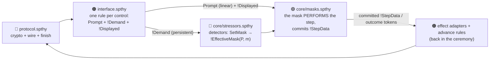

# Ceremony-Mask model — Tamarin analysis of security ceremonies under human stress

A [Tamarin](https://tamarin-prover.com) model of **security ceremonies with a formal human layer**.
The protocol and its interface are modelled as usual; on top of them, a reusable human layer encodes
how a person under stress deviates from the prescribed steps — and Tamarin proves which deviations
are reachable, what security property they break, and which design lever removes them.

Three concepts carry the human model:

- **Mask** — the mode a human operates in. `Attentive` follows the ceremony; the degraded masks
  (`Busy`, `Careless`, `Naive`, `Fearful`, `Habituated`) deviate in a specific, cited way.
- **Stressor (σ)** — a detector that reads what the interface shows the human and pushes a degraded
  mask (e.g. a high-mental-demand step → `Busy`; two confirm prompts → `Habituated`).
- **Lever** — a design change (interface, population, mitigation) under which the same proof shows
  the bad outcome is *unreachable*. A reachable/unreachable pair is the RFC-grade finding.

## The layers

Every ceremony is built as the same five-layer stack (colors match the trace graphs and
`trace_explainer.py`):



The seam between interface and human is the **prompt/perform contract**:

- the interface only **poses** — a linear `Prompt(P,pid,action)` (consumed by exactly one mask
  behaviour), a persistent `!Demand(P,pid,action)` (read by every stressor detector), and
  `!Displayed(P,pid,observables)` (what the UI shows — values and pairs, never a pre-computed verdict);
- the **stressors** read `!Demand` (fatigue comes from being *shown* prompts) plus a context or
  lexicon fact, and push `!EffectiveMask(P, mask)`;
- the **mask** consumes the `Prompt`, performs the step under an active `!EffectiveMask`, and commits
  `!StepData(P,pid,value)` — the value the *human* stands behind (Attentive commits the
  reference-checked value; a degraded mask commits the displayed/attacker one);
- the ceremony's **effect adapters** consume the committed `!StepData` and outcome tokens, and give
  them their meaning (a misdelivered password, a wrong-key finish, a forward to a third party).

The `action` vocabulary is a fixed, ceremony-neutral taxonomy:
`compute · compare · confirm · decide · authorize · share · transcribe · set-policy`.
Nothing in `core/` names a ceremony task — that is what makes the human layer reusable verbatim.

## The masks

| Mask | Behaviour (per action class, from the outcome matrix in `core/framework.spthy`) |
|---|---|
| `Attentive` | performs the step as designed: computes correctly, accepts only `<k,k>` matches, shares out-of-band with the true correspondent |
| `Busy` | slips: commits a fresh WRONG value (compute/transcribe), misdelivers the secret, auto-approves confirms |
| `Careless` | disengages: stalls (safe-fail timeout/dismiss), leaks in-band, misroutes decisions (opt-in) |
| `Naive` | over-trusts: accepts ANY offered artifact at a compare (credulous) |
| `Fearful` | freezes: actively refuses the authorize (abort — safe-fail) |
| `Habituated` | click-through: auto-approves confirms without reading; compare-credulous (opt-in) |

Opt-in `OUTCOME_*` rows extend the matrix per profile (degraded-click, habituated click-through,
careless skip-check, premature grant, careless misroute).

## The stressors

| σ | Flag | Fires on | Pushes |
|---|---|---|---|
| σ₁ HighCognitiveLoad | `SIGMA1_LOAD` | a prompt whose action rates `MentalDemand ≥ 'hi'` in the lexicon | `Busy` |
| σ₂ DistractionConcurrent | `SIGMA2_CONCURRENCY` | a screen marker `!Copresent` (≥2 co-present controls) | `Careless` |
| σ₃ TimePressureDeadline | `SIGMA3_DEADLINE` | a prompt carrying the interface context `!UnderDeadline` | `Busy` |
| AdditiveLoad | `SIGMA_ADDITIVE` | two distinct `'med'`-rated prompts (Sweller's additive load) | `Busy` |
| σ₆ Abstraction | `SIGMA6_ABSTRACTION` | a prompt rating `Effort ≥ 'hi'` (the PGP-fingerprint case) | `Naive` |
| SecurityAnxiety | `SIGMA_ANXIETY` | a prompt rating `Arousal ≥ 'hi'` (Yerkes–Dodson) | `Fearful` |
| σ₈ Habituation | `SIGMA8_HABITUATION` | two distinct `confirm` prompts | `Habituated` |
| σ₉ AlertVolume | `SIGMA9_ALERTVOLUME` | a screen marker `!CopresentDecide` (≥3 decide controls) | `Careless` |
| σ₁₀ RepeatedFailure | `SIGMA10_REPEATFAIL` | a prior human failure `!Failed` (the chaining edge) | `Careless` |
| induced TimePressure | `SIGMA_INDUCED_TIME` | an adversary-injected `!Urgent` context | `Busy` |
| Persuasion cue | `SIGMA_CUE` | a `!Cue(action, principle, 'hi')` (authority/urgency… — Cialdini) | `Naive` |

Detectors are ceremony-blind, once-per-party bounded, and gated by `!StressEnable(P)` (a profile
stresses only the parties it enables). Full detail: [`docs/MODEL.md`](docs/MODEL.md).

## Directory layout

```
tamarin_model/
├── core/                    # the human layer — reused verbatim by every ceremony
│   ├── framework.spthy      # always on: types, level band, pushed-mask state, outcome matrix
│   ├── masks.spthy          # f_H behaviours per action class        (#ifdef MASK_* / OUTCOME_*)
│   ├── stressors.spthy      # the σ detectors                        (#ifdef SIGMA*)
│   ├── demands.spthy        # demand profiles: lexicon / population / interface levers
│   ├── knobs.spthy          # adversary + mitigations
│   └── properties.spthy     # ceremony-agnostic property templates
├── ceremonies/
│   ├── secure_email/        # PRIMARY: Proton-style PGP + password-protected email (S-profiles)
│   └── alex_blake_kdf/      # secondary: two-party KDF handshake (P/K-profiles)
├── tools/
│   └── trace_explainer.py   # narrate + illustrate a theorem's trace in mask terms
└── docs/                    # MODEL.md · AUTHORING_GUIDE.md
```

A **profile** (`S3_trio_mixed.spthy`, `P1_calc_pressure.spthy`, …) is one self-contained theory:
a `#define FLAG` list, `#include "base.spthy"`, its lemmas, `end`. The `#define` list IS the
experiment's manifest — read it to know exactly which masks, stressors and levers are armed.

## Running

```bash
export PATH="$HOME/.local/bin:$PATH"    # tamarin-prover 1.12.0 + maude 3.5.1

# prove a profile (lint by default; every profile must prove in <= 3 min)
python3 .claude/skills/model-tamarin/check.py --prove tamarin_model/ceremonies/secure_email/S0_baseline.spthy

# explain a theorem's trace in mask terms (+ mermaid illustration)
python3 tamarin_model/tools/trace_explainer.py \
    tamarin_model/ceremonies/secure_email/S3_trio_mixed.spthy \
    --lemma S3_forward_outside --illustrate report.md

# browse proofs in the GUI (one server per ceremony dir so #includes resolve)
cd tamarin_model/ceremonies/secure_email && tamarin-prover interactive . --port=3001
```

Every profile states `exists-trace` **failure chains** (interface step → stressor → mask → outcome →
adversary knowledge, in one formula) alongside `all-traces` **security properties** — a chain proves
the cascade is reachable; the property (or its attribution contrapositive) bounds every leak to the
named human mistakes.

## Documentation

| Doc | What it covers |
|---|---|
| [`docs/MODEL.md`](docs/MODEL.md) | the modelling logic layer by layer: the prompt/perform seam, every stressor detector, every mask behaviour, demand calibration, termination discipline |
| [`docs/AUTHORING_GUIDE.md`](docs/AUTHORING_GUIDE.md) | start-here for **adding a new ceremony**: the template, the property patterns, the toolchain, the agnosticism audit, the termination playbook |
| [`docs/DIVERGENCES.md`](docs/DIVERGENCES.md) | the honest record of where the build departed from the plans and what is weaker as a result (its B/D section labels are cited from profile comments) |
| repo-root `MEMORY.md` | the hard-won modelling lessons — read before editing anything here |
