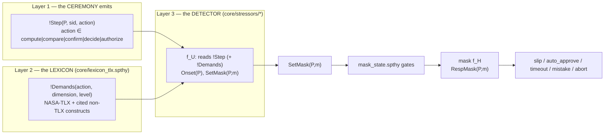
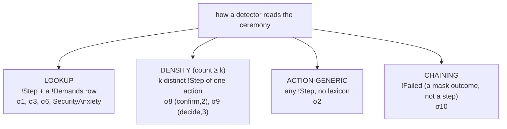
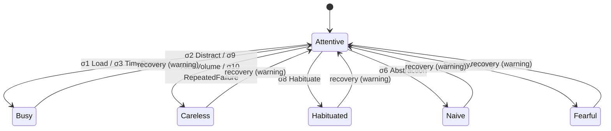

# Stressors — what they are and how each one fires

This document describes the stressor layer of the Tamarin model, **as built** after the
ceremony-agnostic migration (see [`AGNOSTIC_STRESSOR_INTERFACE.md`](docs/AGNOSTIC_STRESSOR_INTERFACE.md)
for the design and rationale). It draws only on the files under `tamarin_model/`.

A stressor is the `f_U` transition function (machinery §6): it reads what the ceremony presents and
shifts a participant from `Attentive` to a degraded mask. **No detector names a ceremony task.** A
ceremony participates by emitting one generic fact per human step — `!Step(P, sid, action)` — in a
fixed interaction taxonomy; the detectors read those, never a `'CALC_SK'`/`'kdf'`/`'verify'` constant.

> **V3 (2026-07-10) — graded dose-response + additivity.** The lookup detectors (σ₁/σ₃/σ₆/anxiety)
> no longer exact-match `'hi'`: they read `!Demands(action, dim, lvl) & !AtLeast(lvl, thr)`, firing on
> a BAND (`'lo' < 'med' < 'hi'`, order seeded in `core/types.spthy`). A step rated below the threshold
> (a hardened interface, an expert population) provably does not fire the detector. New/consolidated:
> **σ₃ `time_pressure_deadline`** (situational — reads a `!UnderDeadline` context) and **σ₂
> `distraction_concurrent`** (k=2 competing prompts, Wickens MRT) REPLACE the retired v1
> `time_pressure` / `external_distraction`; **`additive_load`** fires when TWO distinct `'med'` steps
> co-occur (Sweller's additive load — a case single-step σ₁ is blind to); and the inverted-U is
> explicit — anxiety fires only at `'hi'` arousal, so `'med'` is the facilitating zone. Demonstrations:
> `alex_blake_kdf/P10` (additive), `P11` (inverted-U).

## 1. The three-layer interface



- **Layer 1 — `!Step(P, sid, action)`.** The ceremony's protocol rules emit this for each human step,
  with `action` drawn from a fixed, task-neutral taxonomy. The KDF ceremony's `CALC_SK` and the email
  ceremony's password compose are *both* `compute`; a fingerprint check and a PGP key check are both
  `compare`. (GOMS/KLM interaction-primitive idea, Card, Moran & Newell 1983.)
- **Layer 2 — the lexicon `!Demands(action, dimension, level)`.** [`core/lexicon_tlx.spthy`](core/lexicon_tlx.spthy)
  maps an action to a usability dimension + magnitude, seeded once by an unconditional rule (persistent,
  read-only → no sources loop). This is the *only* place the HCI judgment "a `compute` step is hard /
  urgent" lives, with the citation in the header.
- **Layer 3 — the detector.** Reads `!Step` (and, for the lookup detectors, a `!Demands` row) plus
  `!StressEnable(P)`. Everything below `SetMask` — the persistent current-mask gates in
  [`mask_state.spthy`](core/transitions/mask_state.spthy), the masks, the outcomes — is unchanged by the
  migration. The masks (`f_H`, the *response* layer) still read `!Req`/`!Op`/`!VerifyReq`/`!AuthReq` for
  the *content* of a response; that is the response layer, not stressor collection.

### The interaction taxonomy (Layer 1)

| `action` | meaning | emitted by (producers) |
|---|---|---|
| `compute` | derive/transform a value the human cannot do in-head | `msg3_request`, `msg3_request_confirmed`, `blake_calc_stressable`, `pw_pathway`, `compose_ui` (set_passphrase) |
| `compare` | judge two artefacts equal / authentic | `verify_ui`, `pgp_pathway`, `compose_ui` (confirm_key), `infer_harness` (Pose_verify) |
| `confirm` | accept/dismiss a prompt | `approval_ui`, `approval_shutout_ui`, `deliver` (phish) |
| `decide` | choose among options | `infer_harness` (Pose_decision), `compose_ui` (method menu) |
| `authorize` | grant a privileged action | `authorize_ui` |

### The lexicon (Layer 2)

| Row | Read by | Construct (citation) |
|---|---|---|
| `!Demands('compute','TemporalDemand','hi')` | σ₃ TimePressure | NASA-TLX Temporal Demand (Hart & Staveland 1988) |
| `!Demands('compute','MentalDemand','hi')` | σ₁ HighCognitiveLoad | NASA-TLX Mental Demand / cognitive load theory (Sweller 1988) |
| `!Demands('compare','Effort','hi')` | σ₆ Abstraction | NASA-TLX Effort / PGP key metaphor (Whitten & Tygar 1999) |
| `!Demands('authorize','Arousal','hi')` | SecurityAnxiety | Yerkes–Dodson 1908 (non-TLX — the lexicon is the single "action→construct" table) |

Levels are ordered constants `'lo' < 'med' < 'hi'`; Tamarin has no built-in order on atoms, so detectors
**exact-match** the level they fire on (currently all `'hi'`). The density (σ₈/σ₉), action-generic (σ₂),
and chaining (σ₁₀) detectors do *not* read the lexicon (see §2).

## 2. The detectors

Each row is one rule in `core/stressors/`. Four detector **shapes** replace the old "five trigger
flavours": the agnostic interface no longer has declared/inferred tiers — each construct is one detector.

| Stressor | File | Shape | Reads | Mask | Once-bound |
|---|---|---|---|---|---|
| σ₁ HighCognitiveLoad | `cognitive_load.spthy` | lookup | `!Step` + `!Demands(_,'MentalDemand','hi')` | Busy | `OneStressPerParty` |
| σ₃ TimePressure | `time_pressure.spthy` | lookup | `!Step` + `!Demands(_,'TemporalDemand','hi')` | Busy | `OneTimePressure` |
| σ₆ Abstraction | `abstraction.spthy` | lookup | `!Step` + `!Demands(_,'Effort','hi')` | Naive | `OnceAbstraction` |
| SecurityAnxiety | `security_anxiety.spthy` | lookup | `!Step` + `!Demands(_,'Arousal','hi')` | Fearful | `OnceSecurityAnxiety` |
| σ₈ Habituation | `habituation.spthy` | density (k=2) | two distinct `!Step(_,_,'confirm')` | Habituated | `OnceHabituate` |
| σ₉ AlertVolume | `alert_volume.spthy` | density (k=3) | three distinct `!Step(_,_,'decide')` | Careless | `OneAlertVolume` |
| σ₂ ExternalDistraction | `external_distraction.spthy` | generic | any `!Step(P,_,_)` | Careless | `OneDistractPerParty` |
| σ₁₀ RepeatedFailure | `repeated_failure.spthy` | chaining | `!Failed(P)` (a mask outcome) | Careless | `OneRepeatedFailure` |

Four invariants hold for every detector:

- **Read-only persistent premises.** The rule consumes nothing (`!Step`, `!Demands`, `!Failed` are all
  persistent), so no sources loop arises (machinery §6.2).
- **`!StressEnable(P)` gates the onset.** A stressor fires only for an enabled party
  (`protocol/stress_alex.spthy` / `stress_blake.spthy`). An un-enabled party stays Attentive even when
  its trigger is present.
- **`SetMask(P,m)` carries the mask shift,** read by the persistent current-mask gates in
  [`mask_state.spthy`](core/transitions/mask_state.spthy); the mask is never a stored fact.
- **A `Once*`/`One*` restriction bounds the onset to one per party,** so the interval reasoning in
  `mask_state.spthy` terminates (re-entering a mask is a no-op).

### The four detector shapes



The lookup detectors consult the lexicon (which action → which dimension); the density detectors count
a specific action (the lexicon has no "count" notion — the threshold `k` is documented arity); σ₂ is
action-independent (distraction strikes during any step); σ₁₀'s trigger is a **failure outcome**
(`!Failed`, emitted by `core/masks/busy_op.spthy` on a slip), not a presented step — it is the model's
chaining edge and correctly sits *outside* the Layer-1 interface.

## 3. How each detector fires

The enable premise `!StressEnable(P)` is present in every rule (`stress_alex.spthy` / `stress_blake.spthy`
deposit it) and is omitted below for brevity.

### Lookup detectors — σ₁, σ₃, σ₆, SecurityAnxiety

All four share the shape "an action of a given workload dimension is present." E.g. σ₁:

```
rule Trigger_HighCognitiveLoad:
    [ !Step(P, sid, action), !Demands(action, 'MentalDemand', 'hi'), !StressEnable(P) ]
  --[ Load(P), SetMask(P,'Busy') ]->  [ ]
```

`action` is a variable bound by `!Step` and constrained by `!Demands`; the lexicon row for `'compute'`
makes it fire on any compute step. σ₃ is identical with `'TemporalDemand'` (→ Busy), σ₆ with `'Effort'`
(→ Naive, on a `'compare'` step), SecurityAnxiety with `'Arousal'` (→ Fearful, on an `'authorize'`
step). Because each pins a distinct dimension constant, a `'compute'` step trips only σ₁/σ₃, a
`'compare'` step only σ₆, an `'authorize'` step only SecurityAnxiety — no cross-triggering.

### Density detectors — σ₈ Habituation, σ₉ AlertVolume

```
rule Detect_AlertVolume:                                 // σ9, k=3
    [ !Step(P,r1,'decide'), !Step(P,r2,'decide'), !Step(P,r3,'decide'), !StressEnable(P) ]
  --[ AlertVolume(P), Neq(r1,r2), Neq(r1,r3), Neq(r2,r3), SetMask(P,'Careless') ]->  [ ]
```

σ₈ is the same with two `!Step(_,_,'confirm')` premises (k=2) → Habituated. `Neq` + the `Inequality`
restriction force distinct steps. Counting is at **present time** (the step is shown), so σ₈ models
habituation from being *bombed* with prompts (including injected ones — MFA prompt-bombing) rather than
requiring prior attentive approvals. `Inequality` is identically named in both files, so σ₈ and σ₉ must
not share a theory (kept apart: σ₈ in P2/P6, σ₉ in P4/S1).

### Action-generic — σ₂ ExternalDistraction

```
rule Trigger_ExternalDistraction:
    [ !Step(P, sid, action), !StressEnable(P) ]
  --[ Distract(P), SetMask(P,'Careless') ]->  [ ]
```

`action` is free and unconstrained — distraction can strike during *any* step (Wickens' Multiple
Resource Theory). It is the one `!Step` detector that does not consult the lexicon.

### Chaining — σ₁₀ RepeatedFailure

```
rule Detect_RepeatedFailure:
    [ !Failed(P), !StressEnable(P) ]
  --[ RepeatedFailure(P), SetMask(P,'Careless') ]->  [ ]
```

`!Failed(P)` is emitted by `core/masks/busy_op.spthy` when a Busy user slips — a failure *outcome*, not
a presented step. So σ₁₀ escalates a prior failure (e.g. σ₁ slip → `!Failed` → σ₁₀ → Careless); the
lemma `P4_escalation_requires_failure` checks `RepeatedFailure ⇒ prior Slip`.

## 4. The transitions the stressors drive

Each `SetMask(P,m)` is one edge in the `f_M` graph. The recovery edge belongs to
`protocol/warning_ui.spthy` (`SetMask(P,'Attentive')`), not to a stressor.



## 5. Targeting and bounding

Two restriction families keep the stressor layer controlled.

`!StressEnable(P)` selects the target. `protocol/stress_alex.spthy` deposits it for Alex:

```
rule Enable_Stress_Alex:
    [ !Party('Alex', id) ] --[ StressOn('Alex') ]-> [ !StressEnable('Alex') ]

restriction OnceStressAlex:
  "All #i #j. StressOn('Alex')@i & StressOn('Alex')@j ==> #i = #j"
```

A profile that omits a party's enable leaves that party Attentive. Profile `P1_calc_pressure` proves the
consequence:

```
lemma P1_load_requires_enable:
  all-traces
  "All p #l. Load(p)@l ==> (Ex #s. StressOn(p)@s & #s < #l)"
```

The per-stressor `Once*`/`One*` restriction bounds each onset to one per party. The bound is required: a
stressor reads a persistent fact and would re-fire, and the interval reasoning in `mask_state.spthy`
would not terminate. The bound is semantically a no-op — re-entering a mask the party already holds
changes nothing.
