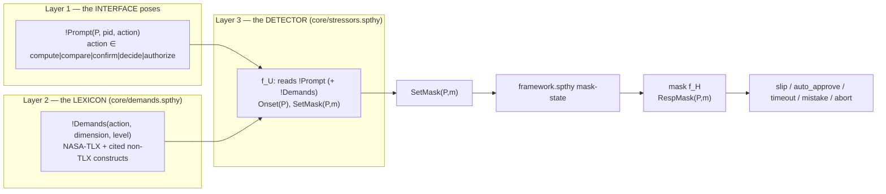
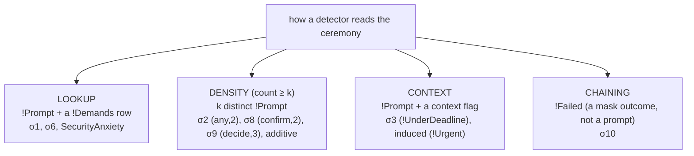
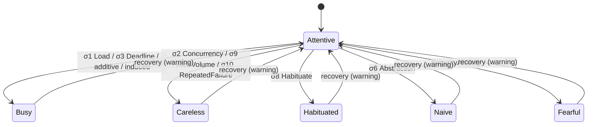

# Stressors — what they are and how each one fires

This document describes the stressor layer of the Tamarin model, **as built** after the
ceremony-agnostic migration (see [`AGNOSTIC_STRESSOR_INTERFACE.md`](docs/AGNOSTIC_STRESSOR_INTERFACE.md)
for the design and rationale). It draws only on the files under `tamarin_model/`.

A stressor is the `f_U` transition function (machinery §6): it reads what the ceremony presents and
shifts a participant from `Attentive` to a degraded mask. **No detector names a ceremony task.** A
ceremony participates when its **interface poses a prompt** — one generic fact per presented step,
`!Prompt(P, pid, action)`, in a fixed interaction taxonomy; the detectors read those prompts, never a
`'CALC_SK'`/`'kdf'`/`'verify'` constant.

> **RELAYER (2026-07-10) — prompt/perform seam.** Detectors now read `!Prompt(P, pid, action)` — *what
> the interface posed* — not `!Step` (which is gone from the seam; the human's committed value, where a
> consumer needs it, is `!StepData`, emitted by the mask). This matches the psychology: fatigue,
> habituation and distraction come from being *shown* prompts, independent of what the user later
> commits. σ₁₀ RepeatedFailure is the one feedback edge and still reads the human `!Failed` outcome.
> The 10 detectors live in one file, `core/stressors.spthy`, each wrapped in `#ifdef SIGMA…` so a
> profile compiles in exactly the ones it arms.

> **V3 (2026-07-10) — graded dose-response + additivity.** The lookup detectors (σ₁/σ₃/σ₆/anxiety)
> no longer exact-match `'hi'`: they read `!Demands(action, dim, lvl) & !AtLeast(lvl, thr)`, firing on
> a BAND (`'lo' < 'med' < 'hi'`, order seeded in `core/framework.spthy`). A step rated below the threshold
> (a hardened interface, an expert population) provably does not fire the detector. New/consolidated:
> **σ₃ `time_pressure_deadline`** (situational — reads a `!UnderDeadline` context) and **σ₂
> `distraction_concurrent`** (k=2 competing prompts, Wickens MRT) REPLACE the retired v1
> `time_pressure` / `external_distraction`; **`additive_load`** fires when TWO distinct `'med'` steps
> co-occur (Sweller's additive load — a case single-step σ₁ is blind to); and the inverted-U is
> explicit — anxiety fires only at `'hi'` arousal, so `'med'` is the facilitating zone. Demonstrations:
> `alex_blake_kdf/P10` (additive), `P11` (inverted-U).

## 1. The three-layer interface



- **Layer 1 — `!Prompt(P, pid, action)`.** The ceremony's interface poses this for each presented step,
  with `action` drawn from a fixed, task-neutral taxonomy. The KDF ceremony's `CALC_SK` and the email
  ceremony's password compose are *both* `compute`; a fingerprint check and a PGP key check are both
  `compare`. (GOMS/KLM interaction-primitive idea, Card, Moran & Newell 1983.)
- **Layer 2 — the lexicon `!Demands(action, dimension, level)`.** [`core/demands.spthy`](core/demands.spthy)
  maps an action to a usability dimension + magnitude, seeded once by an unconditional rule (persistent,
  read-only → no sources loop). This is the *only* place the HCI judgment "a `compute` step is hard /
  urgent" lives, with the citation in the header.
- **Layer 3 — the detector.** Reads `!Prompt` (and, for the lookup detectors, a `!Demands` row) plus
  `!StressEnable(P)`. Everything below `SetMask` — the persistent current-mask gates in
  [`core/framework.spthy`](core/framework.spthy), the masks, the outcomes — is unchanged by the
  re-layer. The masks (`f_H`, the *response* layer) read `!Prompt`+`!Displayed` for the *content* of a
  response; that is the response layer, not stressor collection.

### The interaction taxonomy (Layer 1)

Prompts are posed by the interface layer (`<ceremony>/interface.spthy`) and, in kdf, by the `UI_*` /
`INFER_HARNESS` producers folded into `<ceremony>/protocol.spthy`:

| `action` | meaning | posed by (`!Prompt` producers) |
|---|---|---|
| `compute` | derive/transform a value the human cannot do in-head | email `IF_set_passphrase`; kdf `IF_calc_alex`/`IF_calc_blake`, `Pose_kdf` |
| `compare` | judge two artefacts equal / authentic | email `IF_verify_fp`; kdf `UI_verify_*`, `Pose_verify_*` |
| `confirm` | accept/dismiss a prompt | email `IF_btn_gen`/`IF_btn_fetch`; kdf `UI_*_prompt`/`UI_inject_*`, `IF_nonce_ack_*` |
| `decide` | choose among options | email `IF_weigh_option`; kdf `Pose_decision` |
| `authorize` | grant a privileged action | email `IF_btn_send*`; kdf `UI_authorize_request` |
| `share` | send a secret over a chosen channel | email `IF_btn_share_signal`, `IF_reply_pwreq` |
| `set-policy` | choose a configuration under a control design | kdf `UI_policy_prompt` |

### The lexicon (Layer 2)

| Row | Read by | Construct (citation) |
|---|---|---|
| `!Demands('compute','TemporalDemand','hi')` | σ₃ TimePressure | NASA-TLX Temporal Demand (Hart & Staveland 1988) |
| `!Demands('compute','MentalDemand','hi')` | σ₁ HighCognitiveLoad | NASA-TLX Mental Demand / cognitive load theory (Sweller 1988) |
| `!Demands('compare','Effort','hi')` | σ₆ Abstraction | NASA-TLX Effort / PGP key metaphor (Whitten & Tygar 1999) |
| `!Demands('authorize','Arousal','hi')` | SecurityAnxiety | Yerkes–Dodson 1908 (non-TLX — the lexicon is the single "action→construct" table) |

Levels are ordered constants `'lo' < 'med' < 'hi'`; Tamarin has no built-in order on atoms, so the order
is seeded as `!AtLeast(lvl, thr)` rows (`core/framework.spthy`) and the lookup detectors fire on a BAND
(`!Demands(_,dim,lvl) & !AtLeast(lvl,'hi')`), not one exact constant. The density (σ₂/σ₈/σ₉/additive),
context (σ₃/induced), and chaining (σ₁₀) detectors do *not* read the lexicon (see §2).

## 2. The detectors

Each row is one `#ifdef`-gated block in `core/stressors.spthy` (a profile `#define`s the flag to arm
it). Four detector **shapes** replace the old "five trigger flavours": each construct is one detector,
and every detector except σ₁₀ reads `!Prompt` (what the interface posed).

| Stressor | Flag | Shape | Reads | Mask | Once-bound |
|---|---|---|---|---|---|
| σ₁ HighCognitiveLoad | `SIGMA1_LOAD` | lookup | `!Prompt` + `!Demands(_,'MentalDemand',≥'hi')` | Busy | `OneStressPerParty` |
| σ₂ DistractionConcurrent | `SIGMA2_CONCURRENCY` | density (k=2) | two distinct `!Prompt(P,_,_)` pending | Careless | `OneDistractPerParty` |
| σ₃ TimePressureDeadline | `SIGMA3_DEADLINE` | context | `!Prompt` + `!UnderDeadline(pid)` | Busy | `OneTimePressure` |
| AdditiveLoad | `SIGMA_ADDITIVE` | density (k=2) | two distinct `!Prompt` each `!Demands(_,_,'med')` | Busy | `OnceAdditiveLoad` |
| σ₆ Abstraction | `SIGMA6_ABSTRACTION` | lookup | `!Prompt` + `!Demands(_,'Effort',≥'hi')` | Naive | `OnceAbstraction` |
| SecurityAnxiety | `SIGMA_ANXIETY` | lookup | `!Prompt` + `!Demands(_,'Arousal',≥'hi')` | Fearful | `OnceSecurityAnxiety` |
| σ₈ Habituation | `SIGMA8_HABITUATION` | density (k=2) | two distinct `!Prompt(_,_,'confirm')` | Habituated | `OnceHabituate` |
| σ₉ AlertVolume | `SIGMA9_ALERTVOLUME` | density (k=3) | three distinct `!Prompt(_,_,'decide')` | Careless | `OneAlertVolume` |
| σ₁₀ RepeatedFailure | `SIGMA10_REPEATFAIL` | chaining | `!Failed(P)` (a mask outcome) | Careless | `OneRepeatedFailure` |
| TimePressure (induced) | `SIGMA_INDUCED_TIME` | context | `!Prompt` + `!Urgent(pid)` (adversary) | Busy | `OneInducedTimePressure` |

Four invariants hold for every detector:

- **Read-only persistent premises.** The rule consumes nothing (`!Prompt`, `!Demands`, `!Failed` are all
  persistent), so no sources loop arises (machinery §6.2).
- **`!StressEnable(P)` gates the onset.** A stressor fires only for an enabled party (the
  `Enable_Stress_Alex`/`Enable_Stress_Blake` rules under `STRESS_ALEX`/`STRESS_BLAKE`). An un-enabled
  party stays Attentive even when its trigger is present.
- **`SetMask(P,m)` carries the mask shift,** read by the persistent current-mask gates in
  [`core/framework.spthy`](core/framework.spthy); the mask is never a stored fact.
- **A `Once*`/`One*` restriction bounds the onset to one per party,** so the interval reasoning in
  `core/framework.spthy` terminates (re-entering a mask is a no-op).

### The four detector shapes



The lookup detectors consult the lexicon (which action → which dimension); the density detectors count
distinct `!Prompt` (the lexicon has no "count" notion — the threshold `k` is documented arity); the
context detectors add an interface flag (`!UnderDeadline`, adversary `!Urgent`); σ₁₀'s trigger is a
**failure outcome** (`!Failed`, emitted by the compute-slip mask in `core/masks.spthy`), not a posed
prompt — it is the model's chaining edge and correctly sits *outside* the Layer-1 interface.

## 3. How each detector fires

The enable premise `!StressEnable(P)` is present in every rule (the `Enable_Stress_Alex` /
`Enable_Stress_Blake` rules deposit it) and is omitted below for brevity.

### Lookup detectors — σ₁, σ₆, SecurityAnxiety

All share the shape "a posed prompt of a given workload dimension is present." E.g. σ₁:

```
rule Trigger_HighCognitiveLoad:
    [ !Prompt(P, sid, action), !Demands(action, 'MentalDemand', lvl), !AtLeast(lvl,'hi'), !StressEnable(P) ]
  --[ Load(P), SetMask(P,'Busy') ]->  [ ]
```

`action` is a variable bound by `!Prompt` and constrained by `!Demands`; the lexicon row for `'compute'`
makes it fire on any compute prompt. σ₆ is identical with `'Effort'` (→ Naive, on a `'compare'` prompt),
SecurityAnxiety with `'Arousal'` (→ Fearful, on an `'authorize'` prompt). Because each pins a distinct
dimension constant, a `'compute'` prompt trips only σ₁, a `'compare'` prompt only σ₆ — no
cross-triggering.

### Density detectors — σ₂ Concurrency, σ₈ Habituation, σ₉ AlertVolume, AdditiveLoad

```
rule Detect_AlertVolume:                                 // σ9, k=3
    [ !Prompt(P,r1,'decide'), !Prompt(P,r2,'decide'), !Prompt(P,r3,'decide'), !StressEnable(P) ]
  --[ AlertVolume(P), Neq(r1,r2), Neq(r1,r3), Neq(r2,r3), SetMask(P,'Careless') ]->  [ ]
```

σ₈ is the same with two `!Prompt(_,_,'confirm')` premises (k=2) → Habituated; σ₂ counts two distinct
`!Prompt` of *any* action (competing demands, Wickens' MRT) → Careless; AdditiveLoad counts two distinct
`'med'`-rated prompts → Busy (Sweller's additive load). `Neq` + the `Inequality` restriction force
distinct prompts. Counting is at **present time** (the prompt is shown), so σ₈ models habituation from
being *bombed* with prompts (including injected ones — MFA prompt-bombing) rather than requiring prior
attentive approvals. `Inequality` is identically named across blocks, so detectors that share it must
not co-occur in one theory (e.g. σ₈ in P2/P6, σ₉ in P4/S1).

### Context detectors — σ₃ Deadline, induced TimePressure

```
rule Trigger_TimePressureDeadline:
    [ !Prompt(P, pid, action), !UnderDeadline(pid), !StressEnable(P) ]
  --[ TimePressure(P), SetMask(P,'Busy') ]->  [ ]
```

The prompt carries a context flag the interface attached: `!UnderDeadline(pid)` (situational time
pressure) or, for the adversary-induced variant, `!Urgent(pid)`. Both → Busy.

### Chaining — σ₁₀ RepeatedFailure

```
rule Detect_RepeatedFailure:
    [ !Failed(P), !StressEnable(P) ]
  --[ RepeatedFailure(P), SetMask(P,'Careless') ]->  [ ]
```

`!Failed(P)` is emitted by the compute-slip mask (`Compute_slip` in `core/masks.spthy`) when a Busy user
slips — a failure *outcome*, not a posed prompt. So σ₁₀ escalates a prior failure (e.g. σ₁ slip →
`!Failed` → σ₁₀ → Careless); the lemma `P4_escalation_requires_failure` checks
`RepeatedFailure ⇒ prior Slip`.

## 4. The transitions the stressors drive

Each `SetMask(P,m)` is one edge in the `f_M` graph. The recovery edge belongs to the `UI_WARNING`
re-engagement rule in `alex_blake_kdf/protocol.spthy` (`SetMask(P,'Attentive')`), not to a stressor.



## 5. Targeting and bounding

Two restriction families keep the stressor layer controlled.

`!StressEnable(P)` selects the target. The `STRESS_ALEX` block in `alex_blake_kdf/protocol.spthy` (and
the analogous rule in `secure_email/protocol.spthy`) deposits it for Alex:

```
rule Enable_Stress_Alex:
    [ !Party('Alex', id) ] --[ StressOn('Alex') ]-> [ !StressEnable('Alex') ]

restriction OnceStressAlex:
  "All #i #j. StressOn('Alex')@i & StressOn('Alex')@j ==> #i = #j"
```

A profile that omits a party's enable leaves that party Attentive. Profile `P1_calc_pressure` proves the
consequence:

```
lemma P1_load_requires_enable:
  all-traces
  "All p #l. Load(p)@l ==> (Ex #s. StressOn(p)@s & #s < #l)"
```

The per-stressor `Once*`/`One*` restriction bounds each onset to one per party. The bound is required: a
stressor reads a persistent fact and would re-fire, and the interval reasoning in
`core/framework.spthy` (mask-state section) would not terminate. The bound is semantically a no-op — re-entering a mask the party already holds
changes nothing.
