# Stressors — what they are and how each one fires

This document describes the stressor layer of the Tamarin model. It draws only on the files
under `tamarin_model/`. A stressor is the `f_U` transition function (machinery §6): it reads a
fact the ceremony deposits and shifts a participant from `Attentive` to a degraded mask.

## 1. The shape of a stressor

A stressor is one rule in `core/stressors/`. The rule reads two premises and emits two action
facts:

```
rule Trigger_HighCognitiveLoad:
    [ !Req(P, rid, 'CALC_SK', m, 'Hard'),   // the trigger fact (the ceremony deposits it)
      !StressEnable(P) ]                     // the per-participant enable (Stage B gate)
  --[ Load(P),                               // the onset marker (lemmas read it)
      SetMask(P,'Busy') ]->                  // the mask shift, timed to the onset
    [ ]                                      // no state fact -- the mask is a label, not stored
```

Four invariants hold for every stressor:

- **The trigger fact is persistent (`!...`) and read-only.** The rule consumes nothing, so no
  sources loop arises (lesson §6.2).
- **`!StressEnable(P)` gates the onset.** A stressor fires only for an enabled party
  (`protocol/stress_alex.spthy` / `stress_blake.spthy`). An un-enabled party stays Attentive even
  when its trigger fact is present.
- **`SetMask(P,m)` carries the mask shift, emitted at the onset timepoint.** The persistent
  current-mask gates in `core/transitions/mask_state.spthy` read it; the mask is never a stored
  fact.
- **A `Once*` restriction bounds the onset to one per party.** The rule reads a persistent fact and
  would re-fire otherwise; the bound keeps the interval reasoning in `mask_state.spthy` terminating
  and is a no-op (re-entering a mask changes nothing).

### The common pipeline

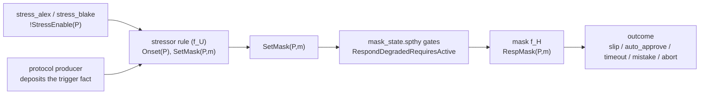

## 2. The ten stressors

Each row is one rule in `core/stressors/`. The trigger fact is the premise the ceremony must
deposit; the producer is the protocol fragment (or mask) that deposits it.

| Stressor | File | Trigger fact (premise) | Producer of that fact | Mask set | Once-bound |
|---|---|---|---|---|---|
| σ₁ HighCognitiveLoad (declared) | `cognitive_load.spthy` | `!Req(P,_,'CALC_SK',_,'Hard')` | `msg3_request` / `msg3_request_confirmed` / `blake_calc_stressable` | Busy | `OneStressPerParty` |
| σ₁ HighCognitiveLoad (inferred) | `cognitive_load_inferred.spthy` | `!Op(P,_,'kdf',_)` | `infer_harness` (`Pose_kdf`) | Busy | `OneLoadPerParty` |
| σ₃ TimePressure | `time_pressure.spthy` | `!Req(P,_,'CALC_SK',_,c)` | `msg3_request` | Busy | `OneTimePressure` |
| σ₂ ExternalDistraction | `external_distraction.spthy` | `!Req(P,_,_,_,_)` (any) | any `!Req` producer | Careless | `OneDistractPerParty` |
| σ₆ Abstraction (declared) | `abstraction.spthy` | `!VerifyReq(P,_,_)` | `verify_ui` | Naive | `OnceAbstraction` |
| σ₆ Abstraction (inferred) | `abstraction_inferred.spthy` | `!Op(P,_,'verify',_)` | `infer_harness` (`Pose_verify_*`) | Naive | `OneAbstractionPerParty` |
| σ₈ Habituation | `habituation.spthy` | two `!Approved(P,_,'Attentive')` | `attentive_approve` (history) | Habituated | `OnceHabituate` |
| σ₉ AlertVolume (inferred) | `alert_volume_inferred.spthy` | three `!Did(P,_)` | `attentive_confirm` / `careless_confirm` | Careless | `OneAlertVolume` |
| σ₁₀ RepeatedFailure (inferred) | `repeated_failure_inferred.spthy` | `!Failed(P)` | `busy_op` (a prior slip) | Careless | `OneRepeatedFailure` |
| SecurityAnxiety | `security_anxiety.spthy` | `!AuthReq(P,_)` | `authorize_ui` | Fearful | `OnceSecurityAnxiety` |

### Trigger flavours

The premise shape sorts the stressors into five flavours:

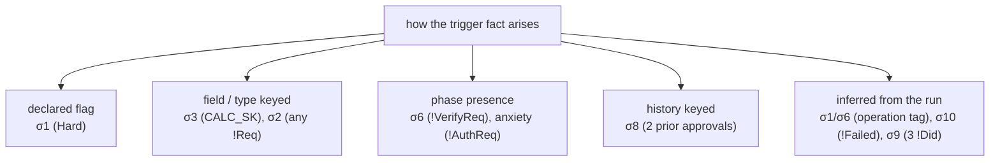

## 3. How each stressor fires

Each subsection gives the rule, the producer line that deposits the trigger fact, and a diagram.
The enable premise `!StressEnable(P)` is present in every rule; `stress_alex.spthy` /
`stress_blake.spthy` deposit it.

### σ₁ HighCognitiveLoad — declared (`cognitive_load.spthy`)

The rule reads a `'Hard'` CALC_SK request and sets Busy.

```
rule Trigger_HighCognitiveLoad:
    [ !Req(P, rid, 'CALC_SK', m, 'Hard'), !StressEnable(P) ]
  --[ Load(P), SetMask(P,'Busy') ]->
    [ ]
```

To fire it, a producer deposits a `'Hard'` request. `protocol/msg3_request.spthy`:

```
rule A_recv_Nb_request:
    [ AlexWait(idA,Na), In(Nb), Fr(~rid) ]
  --[ Request('Alex', ~rid, 'CALC_SK', 'Hard') ]->
    [ AlexAwaitKey(idA, ~rid), !Req('Alex', ~rid, 'CALC_SK', <Na,Nb>, 'Hard') ]
```

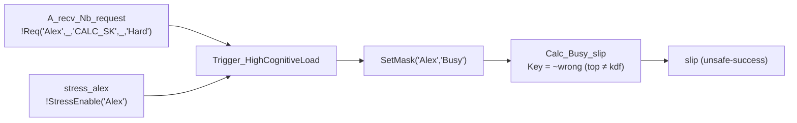

### σ₁ HighCognitiveLoad — inferred (`cognitive_load_inferred.spthy`)

The rule reads the objective operation tag `'kdf'` (no `'Hard'` flag) and sets Busy. It keys on
the tag, not the term (lesson §11).

```
rule Detect_HighCognitiveLoad:
    [ !Op(P, rid, 'kdf', m), !StressEnable(P) ]
  --[ Load(P), SetMask(P,'Busy') ]->
    [ ]
```

`protocol/infer_harness.spthy` deposits the operation:

```
rule Pose_kdf:
    [ OpToken(idA), Fr(~rid), Fr(~Na), In(Nb) ]
  --[ PoseOp('Alex', 'kdf') ]->
    [ !Op('Alex', ~rid, 'kdf', kdf(~Na, Nb)), Pending(idA, ~rid) ]
```

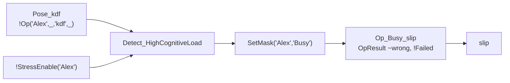

### σ₃ TimePressure (`time_pressure.spthy`)

The rule reads any CALC_SK request (any complexity) and sets Busy — a second route into Busy.

```
rule Trigger_TimePressure:
    [ !Req(P, rid, 'CALC_SK', m, c), !StressEnable(P) ]
  --[ TimePressure(P), SetMask(P,'Busy') ]->
    [ ]
```

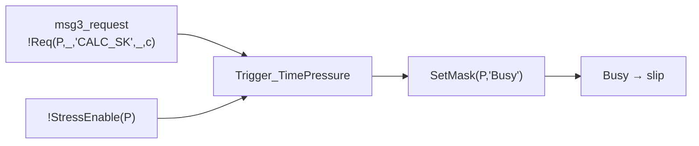

### σ₂ ExternalDistraction (`external_distraction.spthy`)

The rule reads any `!Req` and sets Careless. It inspects no field (the unconditional flavour); it
reads `!Req` to bind the party `P` who has work in hand.

```
rule Trigger_ExternalDistraction:
    [ !Req(P, rid, t, m, c), !StressEnable(P) ]
  --[ Distract(P), SetMask(P,'Careless') ]->
    [ ]
```

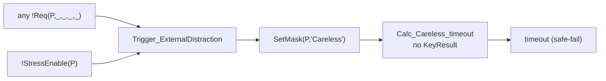

### σ₆ Abstraction — declared (`abstraction.spthy`)

The rule reads a fingerprint-verification request and sets Naive.

```
rule Trigger_Abstraction:
    [ !VerifyReq(P, vid, kind), !StressEnable(P) ]
  --[ Abstraction(P), SetMask(P,'Naive') ]->
    [ ]
```

`protocol/verify_ui.spthy` deposits `!VerifyReq` (genuine or tampered):

```
rule UI_verify_tampered:
    [ !Session('Alex', idA, sk), In(vid) ]
  --[ VerifyPrompt('Alex', vid, 'tampered'), Tampered(vid) ]->
    [ !VerifyReq('Alex', vid, 'tampered') ]
```

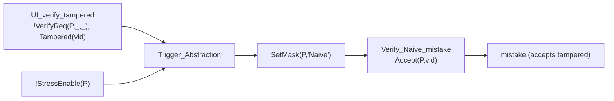

### σ₆ Abstraction — inferred (`abstraction_inferred.spthy`)

The rule reads the operation tag `'verify'` and sets Naive.

```
rule Detect_Abstraction:
    [ !Op(P, rid, 'verify', m), !StressEnable(P) ]
  --[ Abstraction(P), SetMask(P,'Naive') ]->
    [ ]
```

`protocol/infer_harness.spthy` poses a verify operation (`Pose_verify_genuine` /
`Pose_verify_tampered`):

```
rule Pose_verify_tampered:
    [ OpToken(idA), Fr(~vid), In(fp) ]
  --[ PoseOp('Alex', 'verify'), TamperedFp('Alex', ~vid) ]->
    [ !Op('Alex', ~vid, 'verify', fp), Pending(idA, ~vid) ]
```

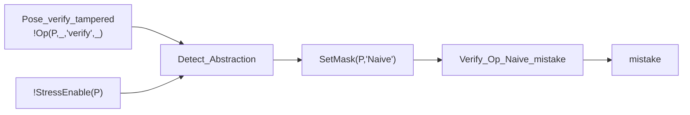

### σ₈ Habituation (`habituation.spthy`)

The rule reads two distinct prior Attentive approvals (the history flavour) and sets Habituated.
`Neq` forces the two prompts to differ; `Inequality` discharges it.

```
rule Trigger_Habituation:
    [ !Approved(P, pid1, 'Attentive'), !Approved(P, pid2, 'Attentive'), !StressEnable(P) ]
  --[ Habituate(P), Neq(pid1, pid2), SetMask(P,'Habituated') ]->
    [ ]
```

`core/masks/attentive_approve.spthy` produces each `!Approved(...,'Attentive')`:

```
rule Approve_Attentive:
    [ !Prompt(P, pid, 'self') ]
  --[ Approve(P, pid, 'Attentive'), RespMask(P,'Attentive'), Verified(P, pid), Answered(pid) ]->
    [ !Approved(P, pid, 'Attentive') ]
```

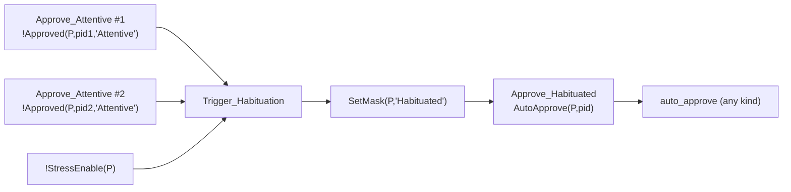

### σ₉ AlertVolume — inferred (`alert_volume_inferred.spthy`)

The rule reads three distinct handled decisions (the density flavour) and sets Careless. `Neq`
forces distinctness on each pair.

```
rule Detect_AlertVolume:
    [ !Did(P, r1), !Did(P, r2), !Did(P, r3), !StressEnable(P) ]
  --[ AlertVolume(P), Neq(r1,r2), Neq(r1,r3), Neq(r2,r3), SetMask(P,'Careless') ]->
    [ ]
```

`core/masks/attentive_confirm.spthy` produces each `!Did`:

```
rule Confirm_Attentive:
    [ !Decision(P, did) ]
  --[ Confirm(P, did, 'Attentive'), RespMask(P,'Attentive'), Handled(P, did), Answered(did) ]->
    [ !Did(P, did), DecisionDone(P, did) ]
```

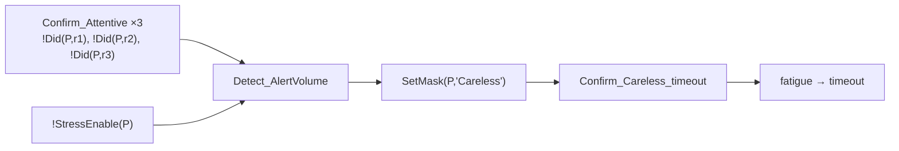

### σ₁₀ RepeatedFailure — inferred (`repeated_failure_inferred.spthy`)

The rule reads a prior failure marker and sets Careless. This is the chaining edge: a σ₁ slip
deposits `!Failed`, and σ₁₀ reads it.

```
rule Detect_RepeatedFailure:
    [ !Failed(P), !StressEnable(P) ]
  --[ RepeatedFailure(P), SetMask(P,'Careless') ]->
    [ ]
```

`core/masks/busy_op.spthy` deposits `!Failed` on a slip:

```
rule Op_Busy_slip:
    [ !Op(P, rid, op, m), Fr(~wrong) ]
  --[ Calc(P,'Busy'), RespMask(P,'Busy'), Mask(P,'Attentive','Busy'), Slip(P), Key(P, ~wrong), Answered(rid) ]->
    [ OpResult(P, rid, ~wrong), !Failed(P) ]
```

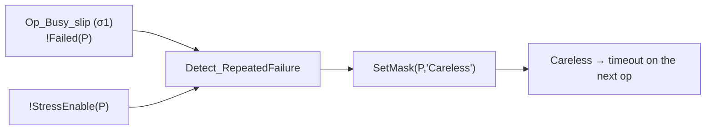

### SecurityAnxiety (`security_anxiety.spthy`)

The rule reads an authorization request and sets Fearful.

```
rule Trigger_SecurityAnxiety:
    [ !AuthReq(P, aid), !StressEnable(P) ]
  --[ SecurityAnxiety(P), SetMask(P,'Fearful') ]->
    [ ]
```

`protocol/authorize_ui.spthy` deposits `!AuthReq`:

```
rule UI_authorize_request:
    [ !Session('Alex', idA, sk), Fr(~aid) ]
  --[ AuthPrompt('Alex', ~aid) ]->
    [ !AuthReq('Alex', ~aid) ]
```

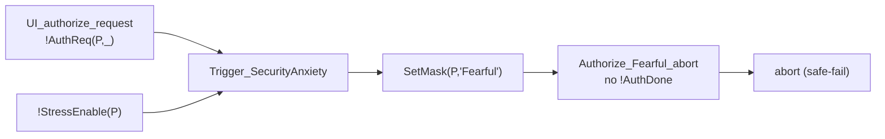

## 4. The transitions the stressors drive

Each `SetMask(P,m)` is one edge in the `f_M` graph. The recovery edge belongs to
`protocol/warning_ui.spthy` (`SetMask(P,'Attentive')`), not to a stressor.

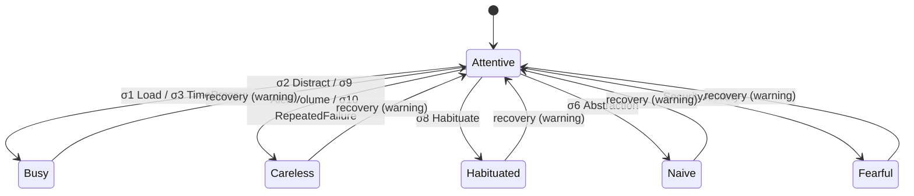

## 5. Targeting and bounding

Two restriction families keep the stressor layer controlled.

`!StressEnable(P)` selects the target. `protocol/stress_alex.spthy` deposits it for Alex:

```
rule Enable_Stress_Alex:
    [ !Party('Alex', id) ] --[ StressOn('Alex') ]-> [ !StressEnable('Alex') ]

restriction OnceStressAlex:
  "All #i #j. StressOn('Alex')@i & StressOn('Alex')@j ==> #i = #j"
```

A profile that omits a party's enable leaves that party Attentive. Profile `P1_calc_pressure`
proves the consequence:

```
lemma P1_load_requires_enable:
  all-traces
  "All p #l. Load(p)@l ==> (Ex #s. StressOn(p)@s & #s < #l)"
```

The per-stressor `Once*` restriction bounds each onset to one per party. The bound is required:
a stressor reads a persistent fact and would re-fire, and the interval reasoning in
`mask_state.spthy` would not terminate. The bound is semantically a no-op — re-entering a mask the
party already holds changes nothing.
