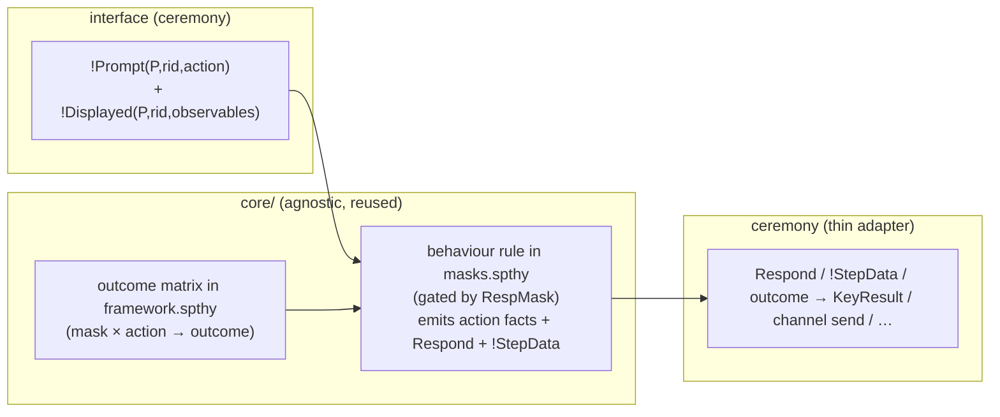

# Agnostic masks (response layer) — design

**Status:** ✅ **IMPLEMENTED** (2026-06-30, updated 2026-07-10). Roadmap item #1. All seven action
classes migrated (compute, compare, confirm, decide, authorize, share, set-policy). As of V3.1 the
behaviours live in one file — [`core/masks.spthy`](../core/masks.spthy) — each `#ifdef MASK_*` /
`OUTCOME_*` block; the outcome matrix lives in [`core/framework.spthy`](../core/framework.spthy). As
of V3.2 (prompt/perform seam) masks read **`!Prompt`+`!Displayed`**, perform the step, and commit
**`!StepData`** where a downstream adapter needs the value. All **17 profiles** prove green.
**Companion:** mirrors [`AGNOSTIC_STRESSOR_INTERFACE.md`](AGNOSTIC_STRESSOR_INTERFACE.md) on the
*other* half of the human layer.

> **V3.2 prompt/perform (2026-07-10).** The interface poses `!Prompt`+`!Displayed`; the mask
> *performs* the step and commits the human's value in `!StepData`. Detectors never read `!StepData`
> (except σ₁₀ reading `!Failed`). Key-confirmation shutdown reads the interface's `!Displayed` (the
> objective correct key), not the human's commit — see `MEMORY.md` lesson 19. The vestigial mask
> `!Step` fact was removed (§5c performance trim).

## 1. Why masks are NOT a mechanical mirror of the stressor migration

A stressor only emits `SetMask` + an onset event — uniform, so reading a generic `!Prompt` was a clean
swap. A mask is different: it **produces the protocol fact that is the human's response**, and that fact
is irreducibly ceremony-specific. Compare the compute cluster:

| | input read | output produced | "correct" value |
|---|---|---|---|
| kdf compute (real protocol) | `!Prompt`+`!Displayed(P,rid,kdf(Na,Nb))` | `Respond` → `KeyResult` | `kdf(Na,Nb)` from `!Displayed` |
| P4 infer harness | `!Prompt`+`!Displayed(P,rid,kdf(~Na,Nb))` | `Respond` → `OpResult` | from `!Displayed` |

The **behaviour** is identical — Attentive→correct, Busy→slip (fresh wrong term), Careless→timeout
— and the **action facts** are identical (`Calc`, `RespMask`, `Slip`/`Timeout`, `Key`, `Answered`).
Only the effect adapter differs. The masks split into:

- **(A) behaviour** — which outcome a (mask, action-class) produces, and the common action facts. Lives
  in `core/masks.spthy`, gated by `#ifdef MASK_*`.
- **(B) effect** — wrapping the outcome's value in the ceremony's protocol fact. Thin adapters in
  `protocol.spthy` / `interface.spthy` (`COMPUTE_KEYRESULT`, `Share_oob_effect`, …).

A new ceremony adds zero `core/` behaviour rules for a standard interaction; it only `#define`s the
`MASK_*` flags its profile uses.

## 2. Design — behaviour policy + Respond event + thin effect adapters

Three pieces, parallel to the stressor side's Layer-1/2/3:

- **Outcome matrix** — seeded in `core/framework.spthy`: `('Attentive',action,'correct')`,
  `('Busy','compute','slip')`, `('Careless','compute','timeout')`, …
- **Behaviour rules** (`core/masks.spthy`) read `!Prompt`+`!Displayed`, consult the matrix, emit
  `RespMask(P,mask)` (gated by the mask-state section in `framework.spthy`) plus action facts, and put
  the response *value* into `Respond(P,rid,value)` and — where needed — `!StepData(P,rid,committed)`.
  The Attentive "correct" value comes from performing against `!Displayed`; a slip mints `Fr(~wrong)`.
- **Effect adapters** (ceremony) read `Respond` or `!StepData` and wrap in the ceremony's fact.

**Why `!Displayed` and `!StepData` are separate:** `!Displayed` is what the UI shows (observables,
never a pre-computed verdict). `!StepData` is what the human *commits* after performing under their
mask — the value advance rules consume. Detectors read neither; they read only `!Prompt`.

## 3. What stays exactly as-is

- **Mask-state gating** in `core/framework.spthy`. Behaviour rules emit `RespMask(P,mask)`; the
  existing restrictions decide which mask is allowed. Unchanged mechanism — only where `RespMask` is
  emitted moved to the consolidated masks file.
- **The action-fact vocabulary** the lemmas read (`Calc`, `Slip`, `Timeout`, `Key`, `AutoApprove`,
  `Accept`, `Mistake`, …) — lemmas are untouched.
- **The stressor side** (detectors read `!Prompt`; lexicon in `demands.spthy`) — collection seam only.

## 4. As built (consolidated layout)

The pilot plan (§4 in the 2026-06-30 draft) generalised cleanly:

1. Outcome matrix → `core/framework.spthy` `[outcome]` section (always on).
2. All behaviour rules → `core/masks.spthy`, one `#ifdef MASK_<CLASS>` block per action class.
3. Interface producers pose `!Prompt`+`!Displayed` (e.g. `IF_calc_alex`, `UI_verify_genuine`).
4. Effect adapters in `protocol.spthy` / `interface.spthy` (`COMPUTE_KEYRESULT`, share effects, …).
5. Opt-in degraded outcome rows (`OUTCOME_HABITUATED_CLICKTHROUGH`, …) are `#ifdef OUTCOME_*` blocks
   in the same `masks.spthy` file.

Compare, confirm, decide, authorize, share, and set-policy followed the same pattern. No per-(mask×action)
files remain.

## 5. Risks to watch

- **Per-outcome `!Failed` divergence.** Compute slips emit `!Failed` for σ₁₀ chaining; other slips may
  not — re-prove when unifying.
- **`Respond` / adapter linkage.** `Respond(P,rid,·)` and the prompt share `rid`; keep `Answered` in
  the behaviour rule only.
- **Partial deconstructions** from new `Respond`/`!StepData` reads — budget a `sources` pass; P3/S4 are
  the blow-up canaries.
- **Adapter coverage.** A theory must include exactly the adapters for the outputs it uses, or facts are
  produced-but-unconsumed (wellformedness failure).
- **FINISH_CONFIRMED trap.** Shutdown must read `!Displayed` (objective correct key), not the human's
  own `!StepData`, or `KeyEq(sk,sk)` becomes trivial.
