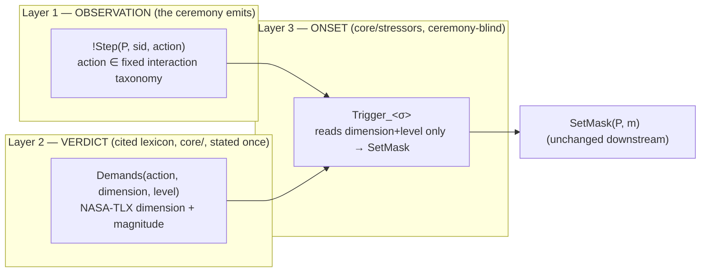

# Agnostic stressor collection — design

**Status:** ✅ **IMPLEMENTED** (2026-06-29). All seven collection detectors now read the agnostic
`!Step` interface; all 9 profiles / 56 lemma checks prove green. See §6 for what landed and the
commits. §1–§4 below are the original design rationale (the "today" they describe is the pre-migration
state); §5–§7 record the realisation. **Companion:** [`STRESSORS.md`](../STRESSORS.md) documents the
layer *as built*.

This document changed the **trigger interface** — the seam where a `core/stressors/*` detector (the
`f_U` function, machinery §6) reaches into a ceremony to "collect" its stressor. Two goals, from the
request that prompted it:

1. **Most agnostic possible** — a `core/` detector should not know any ceremony's task names. *(Met:
   no detector names a task; a new ceremony participates by emitting `!Step` in the fixed taxonomy.)*
2. **Reflect usability research** — the thing a detector reads should be a recognised usability /
   workload construct, with a citation, not an ad-hoc protocol flag. *(Met: NASA-TLX + cited
   non-TLX constructs, in [`core/lexicon_tlx.spthy`](../core/lexicon_tlx.spthy).)*

---

## 1. The problem: the trigger interface leaks the ceremony

Every detector today pattern-matches a **ceremony-specific fact shape with a domain constant baked
into the premise** (the full catalogue is [`STRESSORS.md`](../STRESSORS.md) §2):

| Stressor | LHS premise | What is ceremony-specific |
|---|---|---|
| σ₁ HighCognitiveLoad (declared) | `!Req(P,_,'CALC_SK',_,'Hard')` | task name `'CALC_SK'` **and** author flag `'Hard'` |
| σ₃ TimePressure | `!Req(P,_,'CALC_SK',_,c)` | task name `'CALC_SK'` |
| σ₃ TimePressure (share) | `!Req(P,_,'SHARE_PW',_,c)` | task name `'SHARE_PW'` |
| σ₁ HighCognitiveLoad (inferred) | `!Op(P,_,'kdf',_)` | operation `'kdf'` |
| σ₆ Abstraction | `!VerifyReq(P,_,_)` / `!Op(P,_,'verify',_)` | the `'verify'` phase / op |
| σ₉ AlertVolume (inferred) | three `!Did(P,_)` premises | threshold ≡ rule arity (3) |

Two concrete smells follow directly:

**Smell 1 — the same stressor exists twice.** `time_pressure_share.spthy`
is a verbatim clone of [`time_pressure.spthy`](../core/stressors/time_pressure.spthy); the *only*
difference is `'SHARE_PW'` vs `'CALC_SK'` in the premise. One psychological construct, two files,
because the trigger interface forced the task name into the rule.

**Smell 2 — a second ceremony must speak the detectors' private vocabulary.** The email ceremony
([`secure_email/protocol/compose_ui.spthy`](../ceremonies/secure_email/protocol/compose_ui.spthy))
reuses `core/` "verbatim", but only by emitting `!Req(...'SHARE_PW'...)` **and** `!Op(...'kdf'...)`
**and** `!VerifyReq` **and** `!Decision` at once — shapes chosen to match what each detector happens
to pattern-match, not shapes natural to *sending an email*. Agnosticism is currently achieved by
contorting the protocol, not by a clean interface.

Three further consequences: magnitude is binary and author-declared (`'Hard'`), the σ₉ threshold is
hard-wired as rule arity, and the HCI judgment "this task is hard / urgent / repetitive" is
**scattered across detector premises** rather than stated once where it can be cited.

`STRESSORS.md` §2 even classifies the leak into five "trigger flavours" (declared flag / field-keyed
/ phase-presence / history-keyed / inferred). That taxonomy is a description of the coupling. This
redesign replaces those five flavours with **one** agnostic interface.

---

## 2. Design principle: separate *measurement* from *interpretation* from *onset*

The inferred tier already gestures at this — "the HCI knowledge *kdf is hard* lives in the detector"
(`cognitive_load_inferred.spthy` header). The
redesign makes it a hard, three-layer split so the detector ends up **ceremony-blind**:



- **Layer 1 (ceremony):** the ceremony describes each human step in a **fixed, task-neutral
  interaction taxonomy**, never a domain task name. `kdf` *and* `set_passphrase` are both `compute`;
  `verify key` *and* `check fingerprint` are both `compare`. This is the GOMS / Keystroke-Level
  Model "operator" idea (Card, Moran & Newell 1983): describe interaction by primitive operation,
  not by application semantics.
- **Layer 2 (cited lexicon, in `core/`):** one data table mapping objective features → workload
  dimensions, *with the citation in the file header*. This is the only place HCI knowledge lives.
- **Layer 3 (detector):** reads `Demands(action, dimension, level)` and a threshold — **no task
  name, no operation name, no `'Hard'` flag.** Everything below `SetMask` (the persistent
  current-mask gates in [`mask_state.spthy`](../core/transitions/mask_state.spthy), the masks, the
  outcomes) is **unchanged** — this redesign touches only the LHS of the `f_U` rules and what feeds
  it.

### Proposed Layer-1 interaction taxonomy

A small, fixed set of interaction primitives. Every ceremony step is exactly one:

| `action` | meaning | replaces today's |
|---|---|---|
| `compute` | derive/transform a value the human cannot do in-head | `'CALC_SK'`, `'kdf'`, `set_passphrase` |
| `compare` | judge two artefacts equal / authentic | `'verify'`, `!VerifyReq`, fingerprint check |
| `confirm` | accept/dismiss a prompt | `!Did`, approval prompt |
| `decide` | choose among options | `!Decision`, method choice |
| `authorize` | grant a privileged action | `!AuthReq` |
| `transcribe` | copy/enter a value | (future) |

The list is deliberately short and grounded in interaction primitives, so a new ceremony asks "which
of these *is* my step?" rather than inventing a task constant.

---

## 3. The usability spine: NASA-TLX (Hart & Staveland 1988)

The dimensions in Layer 2 are the **NASA Task Load Index** subscales — the standard subjective
mental-workload instrument. The fit is the strong signal that TLX is the right agnostic spine: its
six axes map almost one-to-one onto the stressors already built.

| NASA-TLX subscale | Existing stressor → mask | Agnostic observable (Layer 1/2) |
|---|---|---|
| **Mental Demand** | σ₁ HighCognitiveLoad → Busy | `Demands('compute','MentalDemand','hi')` |
| **Temporal Demand** | σ₃ TimePressure → Busy | `Demands(action,'TemporalDemand','hi')` — *absorbs both σ₃ clones* |
| **Effort** | σ₆ Abstraction → Naive | `Demands('compare','Effort','hi')` |
| **Frustration** | σ₁₀ RepeatedFailure → Careless | accumulated failure → frustration |
| **Performance** | the slip / mistake / timeout outcomes | (downstream, unchanged) |
| **Physical Demand** | — (none yet; reserved for `transcribe`-heavy steps) | future |

**Mental Demand** maps to **cognitive load theory** (Sweller 1988): a `compute` step imposes high
intrinsic load because it cannot be done in the head — exactly the "kdf is hard" judgment, now
stated once in the lexicon with a citation instead of pattern-matched per rule.

### Stressors NASA-TLX does not cover — name the instrument that does

Three constructs are not workload-per-se; each gets its own cited Layer-2 measure so every detector
still carries provenance:

| Stressor → mask | Construct & citation | Agnostic observable |
|---|---|---|
| σ₈ Habituation → Habituated | warning/security habituation (Anderson, Vance et al., CHI 2015 — polymorphic warnings & habituation; Brustoloni & Villamarín-Salomón 2007) | *repeat-exposure count* on a `confirm` action ≥ k |
| σ₉ AlertVolume → Careless | alarm/alert fatigue (Cvach 2012, clinical alarm fatigue; same habituation line) | *decision density* — `decide`/`confirm` count ≥ k, **k a named parameter, not rule arity** |
| SecurityAnxiety → Fearful | Yerkes–Dodson 1908 (arousal–performance inverted-U) | high-arousal flag on an `authorize` action |
| σ₂ ExternalDistraction → Careless | Wickens' Multiple Resource Theory (2008) | competing-channel flag concurrent with any step |

So the slip vs mistake *outcomes* the masks already produce line up with **Reason's GEMS** (1990) and
**Norman's** action-slip taxonomy (1981) — slips (Busy, execution failures) vs mistakes (Naive,
intention failures). That taxonomy is already implicit in the mask set; the redesign keeps it.

---

## 4. Worked example: collapsing the two σ₃ files

**Today** — two files differing only in a task constant:

```
// core/stressors/time_pressure.spthy
rule Trigger_TimePressure:
    [ !Req(P, rid, 'CALC_SK', m, c), !StressEnable(P) ]  --[ TimePressure(P), SetMask(P,'Busy') ]-> [ ]

// core/stressors/time_pressure_share.spthy   (verbatim clone, 'SHARE_PW')
rule Trigger_TimePressure_Share:
    [ !Req(P, rid, 'SHARE_PW', m, c), !StressEnable(P) ] --[ TimePressureShare(P), SetMask(P,'Busy') ]-> [ ]
```

**Proposed** — one detector, ceremony-blind; the ceremony's task name never appears:

```
// core/stressors/time_pressure.spthy  (the ONLY one)
rule Trigger_TimePressure:
    [ !Step(P, sid, action),
      Demands(action, 'TemporalDemand', 'hi'),   // Layer-2 verdict, NOT a task name
      !StressEnable(P) ]
  --[ TimePressure(P), SetMask(P,'Busy') ]->
    [ ]
```

Each ceremony supplies its own Layer-2 rows for *its* actions, e.g.:

```
// alex_blake_kdf:  the CALC_SK step is a 'compute' under deadline
Demands('compute', 'TemporalDemand', 'hi')
// secure_email:    the password-send step is a 'compute' under deadline — SAME row, SAME detector
```

`time_pressure_share.spthy` is deleted; both ceremonies fire the one σ₃ detector.

---

## 5. Tamarin realisation notes (design risks to validate before building)

The downstream half is safe — `SetMask`, [`mask_state.spthy`](../core/transitions/mask_state.spthy),
masks, outcomes are untouched. The risks are all on the new LHS:

- **Ordered levels.** `'lo' < 'med' < 'hi'` has no built-in order in Tamarin. Either (a) match the
  exact constant the detector wants (`Demands(action,'MentalDemand','hi')` — simplest, no order
  needed), or (b) add a `restriction` encoding the order. Prefer (a): detectors fire on a named
  level, no arithmetic.
- **`Demands` as facts vs. restriction.** Cleanest as a **persistent fact** `!Demands(...)` seeded
  once per ceremony (a tiny `lexicon.spthy` include), read-only — same loop-free discipline as the
  current `!Req` (no consume/reproduce → no sources loop; repo MEMORY.md lesson §6.2). It must be
  seeded by an unconditional rule so the theory stays **closed** (Appendix-A wellformedness).
- **Thresholds (σ₈/σ₉).** `k` distinct `!Step(...,'confirm')` / `!Step(...,'decide')` premises with
  the `Neq` + `Inequality` distinctness pattern. *As built:* `k` stays realised as arity (Tamarin
  counts distinct facts by premise count) but is **documented** as the threshold parameter in each
  detector header (σ₈ k=2, σ₉ k=3) — bump it by adding/removing a premise. `Inequality` is identically
  named in both, so they must not share a theory (kept apart: σ₈ in P2/P6, σ₉ in P4/S1).
- **Partial deconstructions.** Adding a generic `!Step` read risked new partial deconstructions; in
  practice none arose. Re-proved **all 56 lemma checks** (P0–P6 in `alex_blake_kdf` + S0/S1 in
  `secure_email`) after every single detector — the §6a worst-case profile P3 is the canonical blow-up
  canary and stayed green.
- **Keep keying on tags, never terms** (repo MEMORY.md lessons §11/§12): `action` and `dimension`
  are public constants; never destructure a function term like `kdf(x,y)`.

---

## 6. Implementation (as built)

Done as a strangler migration — one detector per step, re-proving all 56 lemma checks each time, the
`!Step` emissions added *additively* alongside the existing facts (which the masks still need). Each
detector's final input:

| Detector | Mask | Reads | Layer-2 construct (citation) |
|---|---|---|---|
| σ₃ TimePressure | Busy | `!Step` + `!Demands('compute','TemporalDemand','hi')` | NASA-TLX Temporal Demand |
| σ₁ HighCognitiveLoad | Busy | `!Step` + `!Demands('compute','MentalDemand','hi')` | NASA-TLX Mental Demand / Sweller 1988 |
| σ₆ Abstraction | Naive | `!Step` + `!Demands('compare','Effort','hi')` | NASA-TLX Effort / Whitten & Tygar 1999 |
| SecurityAnxiety | Fearful | `!Step` + `!Demands('authorize','Arousal','hi')` | Yerkes–Dodson 1908 (non-TLX) |
| σ₉ AlertVolume | Careless | 3× `!Step(_,_,'decide')` (density, k=3) | alarm fatigue / Cvach 2012 |
| σ₈ Habituation | Habituated | 2× `!Step(_,_,'confirm')` (density, k=2) | warning habituation / Anderson & Vance 2015 |
| σ₂ ExternalDistraction | Careless | any `!Step` (action-generic, no lexicon) | Wickens' MRT 2008 |
| σ₁₀ RepeatedFailure | Careless | `!Failed` — **intentionally outside** the interface | frustration; chaining on a mask outcome |

**Lookup vs density vs generic vs chaining.** Four detector *shapes* emerged: the lookup detectors
(σ₃/σ₁/σ₆/anxiety) read `!Step` + a `!Demands` row (the lexicon is consulted); the density detectors
(σ₈/σ₉) count `k` distinct `!Step` of one action (no lexicon — a count, not a per-step level); σ₂ is
action-generic (any `!Step`, no lexicon); σ₁₀ is a **chaining** detector whose trigger is a failure
*outcome* (`!Failed`, emitted by `busy_op`), not a presented step — so it correctly sits outside the
Layer-1 interface and was not migrated, only renamed to drop its `_inferred` suffix.

**Three clone pairs collapsed:** `time_pressure_share`, `cognitive_load_inferred`, `abstraction_inferred`
were deleted (declared+inferred tiers became one agnostic detector each); `alert_volume_inferred` and
`repeated_failure_inferred` were renamed without the suffix.

**Scope boundary — masks unchanged.** The masks (`f_H`, the *response* layer) still read
`!Req`/`!Op`/`!VerifyReq`/`!AuthReq` — those carry the *content* a response needs (which key, which
fingerprint), which is the response layer, not stressor *collection*. So Smell 2 is resolved at the
**collection** seam (no detector names a task); fully converting the masks to `!Step` would be a
separate effort and is out of scope for this goal.

**Commits:** `d44f877` (consolidation + σ₃/σ₁/σ₆), `64d1e91` (σ₉/σ₈/anxiety/σ₁₀), `b10acfd` (σ₂).

---

## 7. Decision log

- **Scope = design only → then implemented in full.** Started as a design doc (no `.spthy`), then the
  user approved building it detector-by-detector; all seven collection detectors migrated, green.
  (User, 2026-06-29.)
- **Present-time vs handle-time counting (σ₈/σ₉).** Count `!Step` at the moment the ceremony *presents*
  the step (not when a mask handles it), so Layer 1 stays ceremony-emitted. For σ₈ this dropped the old
  "prior **Attentive**" filter — judged *more* faithful to prompt-bombing, and the prover confirmed the
  shutout block + recovery causality are independent of how σ₈ triggers. (2026-06-29.)
- **σ₁₀ left on `!Failed`** rather than forced onto `!Step` — a failure is an internal outcome, not a
  presented step. (2026-06-29.)
- **Grounding = NASA-TLX spine + inline citations** — structure Layer 2 on the six TLX subscales,
  cite TLX / cognitive-load theory / alarm-fatigue / Yerkes–Dodson / MRT / GEMS in file headers;
  *not* the heavier multi-instrument encoding (TLX + Cognitive Dimensions + GEMS as separate
  lexicons). (User, 2026-06-29.)
- **Citations** (for the eventual file headers): Hart & Staveland 1988 (NASA-TLX); Sweller 1988
  (cognitive load); Card, Moran & Newell 1983 (GOMS/KLM, interaction primitives); Anderson & Vance
  et al. CHI 2015 + Brustoloni & Villamarín-Salomón 2007 (warning habituation); Cvach 2012 (alarm
  fatigue); Yerkes & Dodson 1908 (arousal–performance); Wickens 2008 (Multiple Resource Theory);
  Reason 1990 / Norman 1981 (slips vs mistakes). Verify each against the venue before committing to
  headers.
