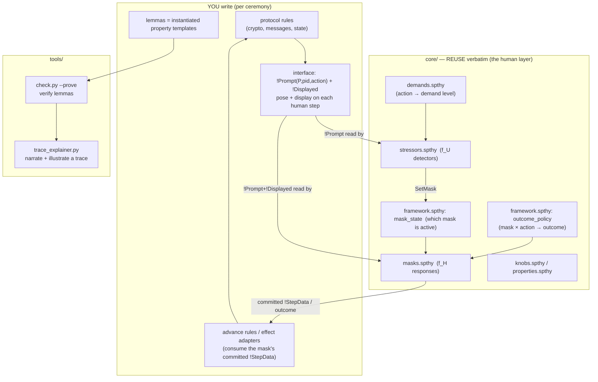
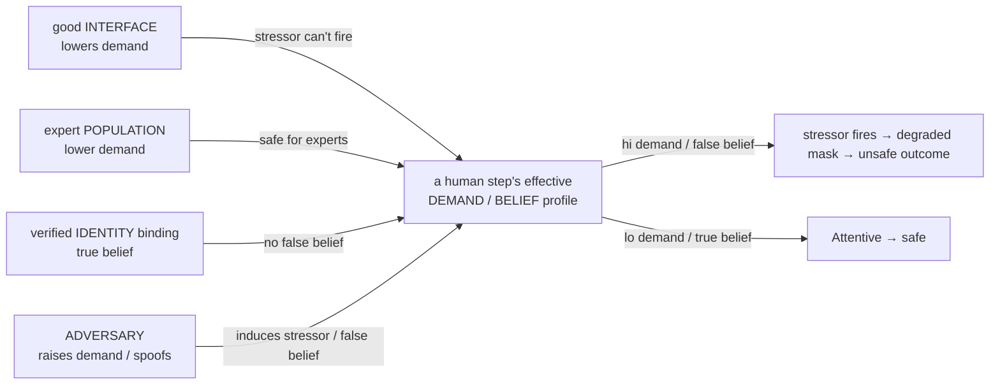
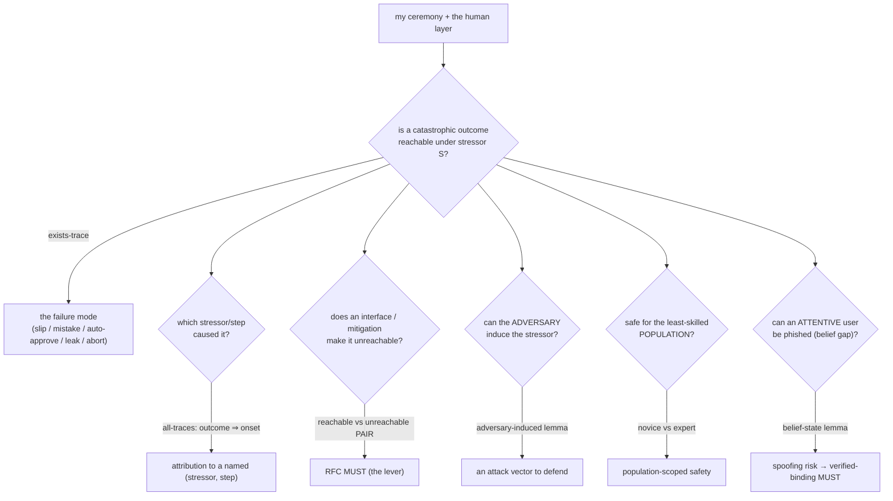
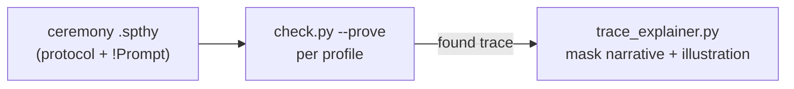

# Modeling a new ceremony — authoring guide

This is the **start-here** guide: how to take a ceremony (your protocol + the human steps in it) and use
the core elements and tools to get **machine-checked usability-security findings** and **RFC-ready
requirements**. The layer-by-layer reference (the prompt/perform seam, every stressor detector, every
mask behaviour, demand calibration) is [`MODEL.md`](MODEL.md); the overview is the
[`README`](../README.md).

## 1. The picture

You write only the **protocol** and the **interface prompts** (`!Prompt`/`!Displayed`). The reusable
**human layer** (`core/`) performs the prompted step and degrades under usability problems; **levers**
(interface / population / adversary / identity)
shift the same demand profile; the **tools** turn the proofs into requirements.

> **The flat template (V3.1).** Both shipped ceremonies use one directory shape — copy it for a new
> ceremony and swap the protocol. One file per layer; selection is by `#ifdef`:
> ```
> core/   framework.spthy (always on) · masks.spthy · stressors.spthy · demands.spthy · knobs.spthy · properties.spthy
> <ceremony>/
> ├── <X>0_baseline.spthy … <X>N.spthy    # profiles: #define flags + #include base + lemmas
> ├── base.spthy    ceremony-constant #defines + the layer #includes
> ├── protocol.spthy   🔵 crypto + setup/exchange + finish (#ifdef FINISH_PLAIN/FINISH_CONFIRMED) + UI producers (#ifdef UI_*)
> ├── interface.spthy  🟠 one rule per control: PROMPTS the user (!Prompt + !Displayed + context like !UnderDeadline)
> └── lemmas.spthy     shared [reuse] lemmas (if any)
> ```
> The stressor layer reads the **interface's** `!Prompt`, never the protocol. A profile `#define`s exactly
> the flags it arms, then `#include "base.spthy"`; each `#ifdef` block compiles in only when its flag is
> set (byte-identical to hand-including the old fragment). Triggering is a graded **dose-response**: the
> demand profile rates a step `'lo' < 'med' < 'hi'` and a lookup detector fires on a BAND —
> `!Demands(action,dim,lvl) & !AtLeast(lvl, thr)` (the order is seeded in `core/framework.spthy`). So a
> good interface / expert population that lowers a step to `'med'`/`'lo'` provably keeps the detector
> from firing. Realism detectors beyond the single-step lookups (all in `core/stressors.spthy`):
> `SIGMA_ADDITIVE` (two `'med'` steps sum past the threshold — Sweller), the inverted-U (`'med'` arousal
> facilitates, `'hi'` freezes — Yerkes-Dodson), and the density detectors (`SIGMA8_HABITUATION`,
> `SIGMA9_ALERTVOLUME`, `SIGMA2_CONCURRENCY`). To SWAP the demand profile, `#define` `POP_EXPERT` /
> `IF_HARDENED` (or an inline seed) instead of `LEXICON_DEFAULT` — see `alex_blake_kdf/P7`, `P9`.



## 2. The core elements you compose

| File (`core/…`) | Role | How you select it |
|---|---|---|
| `framework.spthy` | `OneInstancePerHuman` + `kdf` symbol + the `'lo'<'med'<'hi'` band + the persistent **current-mask** gates + answered-once + the **(mask × action) → outcome** matrix | always on (plain `#include`, no flag) |
| `demands.spthy` | the demand profiles: `LEXICON_DEFAULT` (novice), `POP_EXPERT`, `IF_HARDENED`, `IF_CLEAR`, `IF_MISLEADING` | `#define` the one your profile uses (feeds the lookup detectors σ₁/σ₃/σ₆/anxiety) |
| `masks.spthy` | **f_H** behaviours per action class + the opt-in outcome rows | `#define MASK_<CLASS>` per action class you use (`MASK_COMPUTE`/`MASK_COMPARE`/…); `OUTCOME_*` for opt-in rows |
| `stressors.spthy` | **f_U** detectors that fire a stressor from `!Prompt` (+ demands) | `#define SIGMA<n>_<name>` per stressor you exercise |
| `knobs.spthy` | `ADVERSARY` (inject urgency; feeds `SIGMA_INDUCED_TIME`) + `MITIGATIONS` (shutout / verify-shutout) | `#define ADVERSARY` / `MITIGATIONS` |
| `properties.spthy` | 2 generic invariants + 4 property **templates** | `#define PROPERTIES` for the invariants; instantiate the templates in your profile |

The masks/stressors **key on the party `P`**, so they are ceremony- and party-generic — you add no `core/`
rules for a standard interaction; you only `#define` the flags your profile arms.

## 3. The action taxonomy + `!Prompt` cheat-sheet

Every human step is **one** action the interface POSES with `!Prompt(P,pid,action)`. Add
`!Displayed(P,pid,shown)` only when a performed step needs the UI's *observables* — what the UI shows,
never a pre-computed verdict (verdicts are derived in the mask layer, which then commits `!StepData`).

| `action` | the human is… | `!Displayed` shows | detectors that read the prompt |
|---|---|---|---|
| `compute` | deriving a value they can't do in-head | the correct value (e.g. `kdf(a,b)`) | σ₁ (Mental), σ₃ (Temporal) |
| `compare` | judging two artefacts equal/authentic | `<offered, reference>` — Attentive *performs* the comparison (matches `<k,k>`); tamperedness is never declared | σ₆ (Effort) |
| `confirm` | accepting/dismissing a prompt | `<claimed, own>` — Attentive *performs* the self-check (matches `<k,k>`); injectedness is never declared | σ₈ (Habituation, density) |
| `decide` | choosing among options | — | σ₉ (AlertVolume, density) |
| `authorize` | granting a sensitive op | — | SecurityAnxiety (Arousal) |
| `share` | disclosing a secret over a channel | `<recipient, secret>` | σ₁/σ₃ via lexicon |
| `set-policy` | configuring access (task-mediated) | — (the control's design quality is a profile-level interface seed, `!ControlDesign` via `interface_clear_policy` / `interface_misleading_policy`, never step data) | σ₄ (Pathway B — task, not mask) |
| `transcribe` | typing a value into a field (To / subject / hint / pw / nonce / key) | `<intended>` — Attentive types it; Busy slips a fresh wrong value (`!Failed`→σ₁₀); Careless leaks it in-band (`TranscribeLeaked` fact — the *ceremony* effect rule routes the `Out`) | SIGMA_ADDITIVE (two co-present `'med'` fields); σ₁₀ via the slip's `!Failed` |

σ₂ Concurrency reads **any two** distinct `!Prompt` (competing demands). The outcome a mask produces per
action is in the `outcome_policy` matrix (`core/framework.spthy`); if that outcome must drive the
protocol (a wrong key, an approval that gates a signature), consume the behaviour's output fact
(`Respond` / `Checked` / `Confirmed`) — or the mask's committed `!StepData` — in a one-line **advance /
effect adapter** (see the `COMPUTE_KEYRESULT` / `MASK_COMPARE_KEYCHECKED` blocks and the
`Share_*_effect` rules in `secure_email/interface.spthy`).

**Screen-posing pattern (one rule per screen).** When a *screen* shows several co-present controls at
once, pose ALL of that screen's `!Prompt`/`!Displayed` from ONE interface rule off ONE shallow source
(the ceremony's init/session fact), once-bounded via a `Pose<screen>` action + a `restriction`
(`OncePose<screen>`), exactly as `IF_verify_fp`/`OncePoseVerify` does. Rationale: σ₂'s two-`!Prompt`
source product then stays a product of *shallow* sources (no blow-up), and co-presence becomes real
instead of stubbed. A control that no answer drives is posed **exposure-only** (counted by density, never
performed — lesson 15a/15b). The mask commits `!StepData`; the screen's **effect** rule joins the
committed data *in the ceremony's order* (address before send, verify before send, unlock before reply).

**Order & route levers.** `OUTCOME_PREMATURE` (core/masks.spthy) lets a degraded authorize emit
`GrantedUnchecked` instead of `Granted`; the ceremony adds ONE effect rule that consumes
`GrantedUnchecked` *without* its upstream verify join and routes the consequence (`Out(m)` / unsafe
session) — that rule is where "the order was violated" gets meaning (`UP_premature_requires_degrade`
holds it to a prior degrade). `OUTCOME_CARELESS_MISROUTE` is the analog for `decide`: it emits
`DecisionMisrouted`, and the ceremony effect rule says what the wrong route is. Keep the *effect* in the
ceremony — core only provides the lever (the step-10 `grep` over `core/` keeps this honest).

## 4. Step-by-step: a new ceremony from scratch

```mermaid
flowchart LR
  A["1. Write the protocol<br/>(rules with the human's steps)"] --> B["2. Pose interface prompts<br/>!Prompt + !Displayed"]
  B --> C["3. Include the human layer<br/>framework + demands + masks + stressors"]
  C --> D["4. Add effect adapters<br/>if a step gates the protocol"]
  D --> E["5. Pick an interface / population<br/>(swap the demand profile)"]
  E --> F["6. Instantiate property templates<br/>(core/properties.spthy)"]
  F --> G["7. check.py --prove<br/>iterate until green"]
  G --> H["8. trace_explainer.py<br/>narrate + illustrate the chains"]
```



**Skeleton entry theory** (copy, fill the protocol + lemmas):

```
theory MyCeremony
begin
// builtins: signing      // only if you use real crypto (signatures/aenc/…)

// --- 3. select the reusable human layer by flag (BEFORE the includes read them) ---
#define LEXICON_DEFAULT       // or POP_EXPERT / IF_HARDENED / an inline demand seed
#define MASK_CONFIRM          // the action class(es) you use
#define SIGMA8_HABITUATION    // the stressor(s) you exercise

#include "../../core/framework.spthy"   // always on: types + mask-state + answered-once + outcome matrix
// --- 1+2. your interface POSES a prompt (+ DISPLAYS observables); the mask performs it ---
// rule UI_prompts_transfer:
//     [ Session($A, sid), In(req) ]
//   --[ Prompted($A, ~pid) ]->
//     [ !Prompt($A, ~pid, 'confirm'), !Displayed($A, ~pid, <~pid,~pid>), Pending(~pid, req) ]
//   // core/masks.spthy then reads !Prompt+!Displayed, performs the confirm, and emits Confirmed(...)
//   // (+ committed !StepData only if your advance rule needs the value).

// --- per-party stress enable (Stage B targeting) ---
// rule Enable: [ !Party($A, id) ] --[ StressOn($A) ]-> [ !StressEnable($A) ]
// restriction OnceStress: "All a #i #j. StressOn(a)@i & StressOn(a)@j ==> #i = #j"

#include "../../core/demands.spthy"     // the demand profile (guarded by the flag above)
#include "../../core/masks.spthy"       // the behaviours (guarded by MASK_*)
#include "../../core/stressors.spthy"   // the detectors (guarded by SIGMA*)
// #include "../../core/knobs.spthy" / "../../core/properties.spthy"  // if you #define ADVERSARY/MITIGATIONS/PROPERTIES

// --- 4. effect adapter (only if the approval gates a protocol step) ---
// rule Approval_to_action: [ Confirmed($A, pid, m), Pending(pid, req) ] --> [ DoAction(req) ]

// --- 6. lemmas: instantiate the templates from core/properties.spthy ---
// lemma bad_outcome_reachable: exists-trace "Ex ... AutoApprove(...) ..."
// lemma fixed: all-traces "not (Ex ...)"

end
```

(For a multi-profile ceremony, factor the shared `#define`s + `#include`s into a `base.spthy` and make
each profile a `#define` list + `#include "base.spthy"` + its lemmas, as the two shipped ceremonies do.)

Then: `python3 .claude/skills/model-tamarin/check.py --prove tamarin_model/ceremonies/myceremony/MyCeremony.spthy`.
If `P3`-style worst cases stop terminating, see §9 below (narrow the enabled set).

## 5. The lever — one mechanism, four views

Most findings reduce to **the same demand/belief profile**, moved by four different actors. Understanding
this tells you what knob to turn:



- **Lower it** (a hardened interface / expert population / verified identity) → the unsafe outcome becomes
  unreachable → an RFC `MUST` (e.g. "present a low-effort comparison", "bind identity to a credential").
- **Raise it** (the adversary injects urgency / spoofs identity) → the unsafe outcome is reachable → an
  attack the RFC must defend.

## 6. What you can find

The model answers these questions, each as a lemma you prove:



Concretely, the model lets you find:

- **Reachable human-factors failures** — does a stressed human break the security goal? (`*_reachable`).
- **Attribution** — every breach/degradation traces to a named stressor + step + party, not "user error"
  (`*_requires_*`, `UP_degradation_is_attributable`).
- **Which lever fixes it** — a reachable/unreachable proof *pair* across interface or mitigation variants
  yields a normative `MUST`/`SHOULD`.
- **Adversary-weaponisable stressors** — which degradations an attacker can *induce* (prompt-bombing,
  injected urgency), hence must be defended (#6, `P8_adversary`).
- **Population scope** — is a ceremony safe only for experts? (#4, `P9_population`).
- **Belief/phishing gaps** — can an Attentive user be made to act on a false belief? (#5; the belief-state
  layer's worked example was retired 2026-07-09, design in git history — see ROADMAP #5).
- **What the analysis assumed** — every requirement is traced to named lemmas in named profiles;
  recalibrate a demand level and re-prove to test sensitivity ([`MODEL.md`](MODEL.md) §5).

## 7. The toolchain



- `python3 .claude/skills/model-tamarin/check.py --prove <profile.spthy>` — verify a profile's lemmas.
- `python3 tamarin_model/tools/trace_explainer.py <profile.spthy> --lemma <name>` — prove one lemma,
  capture its found trace (exists-trace verified, or an all-traces counterexample) and narrate it in
  mask terms: what pushed the mask (`SetMask` + the detector's trigger facts), how the masked human
  performed each prompt (displayed vs committed `!StepData`, outcome labels, the Attentive-deviation
  marker), and the effects (which ceremony rules consumed the commit, what reached `Out`/the adversary).
  Ceremony-agnostic: keys only on `core/` facts. `--json <file>` re-explains a saved `--output-json`
  trace; `--illustrate <out.md>` also writes a Markdown report opening with a mermaid sequence diagram
  of the trace (interface / human / ceremony / adversary lanes; renders in the VS Code preview).
- `tamarin-prover interactive <ceremony-dir> --port=3001` — browse/step proofs in the GUI (run one server
  per ceremony directory so `#include`s resolve).

## 8. Checklist

- [ ] Protocol + interface rules written; each human step is POSED as `!Prompt(P,pid,action)`
      (+ `!Displayed(P,pid,shown)` for a performed step). The mask performs it and commits `!StepData`.
- [ ] Every human step in the protocol is posed by an interface rule (no human step missed).
- [ ] Human layer selected: `#include core/framework` (always) + `#define` the `MASK_*` classes, the
      `SIGMA*` detectors, and one demand profile (`LEXICON_DEFAULT` or an interface/population) + a stress-enable.
- [ ] Effect adapter added wherever a human outcome must drive the protocol.
- [ ] Property templates instantiated (reachability + attribution + the lever pair).
- [ ] `check.py --prove` green for every profile (see §9 if it stalls).
- [ ] Headline chains explained/illustrated with `trace_explainer.py` (the trace tells the intended story).

## 8b. The agnosticism audit (mechanical — run it before every commit to `core/`)

`core/` must never learn a ceremony's vocabulary. Three checks:

```bash
# (a) no ceremony constant may appear in core/
grep -nE "'(Alex|Blake|composer|subject|hint|pgp|pw|nonce|chat)'" tamarin_model/core/   # must be EMPTY

# (b) every MASK_*/SIGMA*/OUTCOME_* flag is armed by BOTH ceremonies, or listed with a reason
# (c) a new core block must be consumed by BOTH ceremonies unchanged -- that is the proof it is agnostic
grep -rl "#define MASK_TRANSCRIBE"   tamarin_model/ceremonies/*/   # both ceremonies
grep -rl "#define OUTCOME_PREMATURE" tamarin_model/ceremonies/*/   # both ceremonies
```

Single-ceremony flags are allowed but must be *deliberate*: `MASK_POLICY`, `SIGMA_INDUCED_TIME`,
`MASK_COMPARE_VERIFYDONE` (kdf-only); `SIGMA_CUE`, `OUTCOME_CARELESS_MISROUTE`,
`OUTCOME_HABITUATED_CLICKTHROUGH`, `OUTCOME_CARELESS_SKIPCHECK` (secure_email-only). **`SIGMA9_ALERTVOLUME`
is currently kdf-only and that is a GAP, not a decision** — see [`DIVERGENCES.md`](DIVERGENCES.md).

The rule that makes this work: **core provides the LEVER, the ceremony provides the EFFECT.** Core's
`OUTCOME_PREMATURE` emits `GrantedUnchecked` and knows nothing about what the grant was waiting for; each
ceremony writes the one effect rule that consumes it (`SendPremature` / `SessionUnconfirmed`). That is why
the same core lever yields an RFC requirement in two unrelated ceremonies.

## 9. Termination & scale playbook

Attaching the human layer to a real protocol is cheap by design — the risk at scale is state-space
explosion in Tamarin's backward search (masks × stressors × phases × parties). Every profile must
prove within the **3-minute budget**, run capped (the box has no swap — a runaway proof OOM-freezes
it):

```bash
MAUDE_LIB=/usr/share/maude python3 .claude/skills/model-tamarin/check.py \
    --prove --timeout 178 <profile.spthy> -- +RTS -M6G -RTS
```

A timeout is a MODELLING gate, not a knob to raise. The levers, each used in this model (details and
rationale: [`MODEL.md`](MODEL.md) §7):

| Lever | Why |
|---|---|
| one instance per human; one onset per detector per party; one `SetMask` per mask | persistent triggers re-fire forever without the bound (the bound is a semantic no-op) |
| pushed `!EffectiveMask` — no compose/read-back | keeps the mask's source graph acyclic |
| density as screen markers (`!Copresent`) + groundedness lemmas | "any k of N prompts" is O(N^k) in source saturation |
| gate the PATHWAY per profile (e.g. `PATH_PGP` xor `PATH_PW`) | halves the surface — stressor trios went >3 min → 13 s |
| exposure-only prompts; don't arm behaviours whose answers drive nothing | every human-gated crossing multiplies the all-traces search |
| `[reuse]` helpers for K-facts; per-lemma `[heuristic=C]` | prove the expensive adversary-knowledge story once |
| never prove both attribution AND attentive-keeps-secret | exact contrapositives — one proof suffices |

When a worst-case profile stops terminating: stress ONE party, drop a phase/pathway flag the property
under test does not need, cap the armed `SIGMA*` set, or split into per-phase profiles. Two honest
limits: the analysis is possibilistic (reachable, not likely), and unbounded prompt-flooding must be
modelled with a fixed small k (document the cap).
