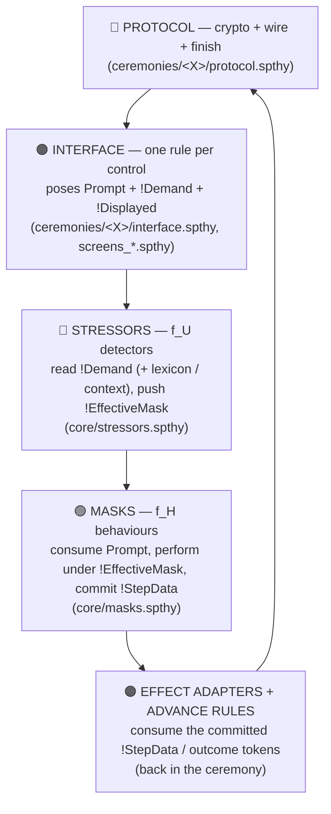

# The modelling logic, layer by layer

This is the reference for how the Ceremony-Mask model works: each layer, the seam between them, every
stressor detector and every mask behaviour, how demand levels are calibrated, and the discipline that
keeps proofs terminating. It describes the model **as built** in `core/` — read it next to
[`../core/framework.spthy`](../core/framework.spthy), [`../core/stressors.spthy`](../core/stressors.spthy),
[`../core/masks.spthy`](../core/masks.spthy) and [`../core/demands.spthy`](../core/demands.spthy).
For adding a ceremony, start at [`AUTHORING_GUIDE.md`](AUTHORING_GUIDE.md) instead.

The analysis is **possibilistic, not probabilistic**: a proof says a bad outcome is *reachable* under
a stressor (or *unreachable* under a lever), never how likely it is. Reachability under realistic,
cited stressors is the claim the findings rest on.

## 0. The stack



Layers 1–2 and 5 are the ceremony's (they know its tasks, secrets and channels); layers 3–4 are
`core/`, reused **verbatim** by every ceremony. The contract that separates them:

> **core provides the LEVER, the ceremony provides the EFFECT.** A core rule emits a generic token
> (`TranscribeLeaked`, `GrantedUnchecked`, `DecisionMisrouted`, …) and knows nothing about what it
> means; the ceremony writes the one effect rule that consumes it (the password lands in the mail
> hint; the send fires before the key check; the reply goes to a keyless third party).

## 1. Protocol layer (🔵)

Plain Tamarin: builtins, wire rules, `Out`/`In` for the Dolev-Yao network, private `Oob(...)` facts
for out-of-band channels, and the finish rules. Two framework-level constraints apply everywhere
(`core/framework.spthy`):

- `OneInstancePerHuman` — at most one `Start(p)` per identity per trace (no concurrent sessions of
  the same person).
- ground-truth actions for lemmas only (`Secret`, `Tampered`, `Injected`, …) live on protocol rules;
  they are never readable by the human layer (memory lesson 14: the interface shows observables,
  never verdicts).

## 2. Interface layer (🟠) — the prompt/perform seam

One rule per control the human can see. A **performed** control emits three facts:

| Fact | Linearity | Read by | Meaning |
|---|---|---|---|
| `Prompt(P, pid, action)` | linear | one mask behaviour (consumed) | the step was POSED; consuming it makes each prompt performed exactly once |
| `!Demand(P, pid, action)` | persistent | every stressor detector (lookup) | the exposure signal — being *shown* prompts is what fatigues, independent of what the user commits |
| `!Displayed(P, pid, observables)` | persistent | the mask | what the UI SHOWS — a value, or a pair of observables (`<offered, reference>` at a compare; `<claimed, own>` at a confirm; `<recipient, correspondent, pw>` at a share) |

Rules of the seam:

- **Observables, never verdicts.** `!Displayed` must carry what a human could actually see. The
  Attentive mask PERFORMS the check by pattern-matching equal observables (`<k,k>`); a producer that
  pre-computes `'genuine'`/`'tampered'` has smuggled the security judgment into the UI.
- **Exposure-only controls emit `!Demand` with NO `Prompt`.** They are counted by the density
  detectors but never performed — zero branching cost. Pose a `Prompt` only for a control whose
  outcome drives something (memory lessons 15b/22).
- **Context facts ride the prompt.** A deadline is `!UnderDeadline(pid)`; adversary-injected urgency
  is `!Urgent(pid)`; a persuasion lure is a `!Cue(action, principle, level)` row. The stressor layer
  reads these, the mask does not.
- **Screen density is a marker.** A screen showing ≥2 co-present controls emits `!Copresent(P)`
  (≥3 decide controls: `!CopresentDecide(P)`). The "any k of N prompts" form is O(N^k) in source
  saturation and explodes on real screens, so the ceremony *asserts* density and two ungated lemmas
  in `core/properties.spthy` (`UP_copresence_is_grounded`, `UP_decide_density_is_grounded`) verify
  the assertion is honest — a screen claiming density it did not pose FAILS.

The `action` taxonomy is fixed and ceremony-neutral (GOMS/KLM interaction primitives — Card, Moran &
Newell 1983): `compute` (derive a value the human cannot do in-head) · `compare` (judge two artifacts
equal/authentic) · `confirm` (accept/dismiss a claim) · `decide` (choose among options) · `authorize`
(grant a privileged action) · `share` (send a secret over a chosen channel) · `transcribe` (enter a
value into a field) · `set-policy` (configure under a control design).

## 3. Stressor layer (🔴) — f_U detectors

A detector reads the interface's exposure signal and **pushes** a degraded mask:
`!EffectiveMask(P, mask)` is produced directly (Approach A), the onset is recorded by the
`SetMask(P, mask)` action, and a `Once*` restriction bounds each detector to one onset per party.
No detector names a ceremony task — the HCI judgment lives in the lexicon (§5).

| σ | Shape | Reads | Pushes | Construct (citation) |
|---|---|---|---|---|
| σ₁ HighCognitiveLoad | lookup | `!Demand` + `!Demands(action,'MentalDemand',lvl)` ≥ `'hi'` | `Busy` | NASA-TLX Mental Demand; Sweller 1988 |
| σ₂ DistractionConcurrent | marker | `!Copresent(P)` | `Careless` | Wickens' Multiple Resource Theory |
| σ₃ TimePressureDeadline | context | `!Demand` + `!UnderDeadline(pid)` | `Busy` | Maule & Svenson; NASA-TLX Temporal |
| AdditiveLoad | density k=2 | two distinct `'med'`-rated `!Demand` | `Busy` | Sweller's additive load |
| σ₆ Abstraction | lookup | `!Demands(action,'Effort',lvl)` ≥ `'hi'` | `Naive` | Whitten & Tygar 1999 |
| SecurityAnxiety | lookup | `!Demands(action,'Arousal',lvl)` ≥ `'hi'` | `Fearful` | Yerkes–Dodson 1908 (inverted-U: `'med'` facilitates) |
| σ₈ Habituation | density k=2 | two distinct `confirm` `!Demand` | `Habituated` | Anderson & Vance CHI 2015 |
| σ₉ AlertVolume | marker | `!CopresentDecide(P)` | `Careless` | alarm fatigue, Cvach 2012 |
| σ₁₀ RepeatedFailure | chaining | `!Failed(P)` — a mask outcome, not a prompt | `Careless` | frustration; the escalation edge |
| induced TimePressure | context | `!Demand` + adversary `!Urgent(pid)` | `Busy` | adversary-weaponised σ₃ |
| Persuasion cue | lookup | `!Cue(action, principle, lvl)` ≥ `'hi'` | `Naive` | Cialdini principles (authority/urgency/…) |

The lookup shape, concretely (σ₁):

```
rule Trigger_HighCognitiveLoad:
    [ !Demand(P, sid, action), !Demands(action, 'MentalDemand', lvl), !AtLeast(lvl, 'hi'),
      !StressEnable(P) ]
  --[ Load(P), SetMask(P, 'Busy') ]->
    [ !EffectiveMask(P, 'Busy') ]
```

Four invariants hold for every detector:

1. **Read-only persistent premises** — nothing is consumed and reproduced, so the sources solver
   cannot loop.
2. **`!StressEnable(P)` gates the onset** — a profile stresses only the parties it enables; an
   un-enabled party provably stays Attentive.
3. **Pushed mask, acyclic sources** — no producer of `!EffectiveMask` reads `!EffectiveMask`.
   The baseline `Attentive` and any pushed degrades COEXIST: a stressed human may act as any active
   mask, a safe over-approximation (the worst-case breach stays reachable; attribution still holds).
4. **Once-per-party bound** — re-entering a mask you already hold changes nothing, and the bound
   keeps `SetMask` events finite.

**Coverage lemmas.** A detector that never fires is invisible (missing lexicon row, missing emission,
missing `#define`). Every armed stressor is paired with a one-line
`exists-trace "Ex #i. <Onset>(p)@i"` lemma so all three drift modes show up as a FAIL (lesson 16).

## 4. Mask layer (🟢) — f_H behaviours

A behaviour rule consumes the `Prompt`, requires an active `!EffectiveMask(P, mask)` and the matching
row of the **outcome matrix** `!OutcomePolicy(mask, action, outcome)` (seeded in
`core/framework.spthy`), performs the step, and emits:

- `RespMask(P, mask)` — which mask answered (every behaviour);
- `Mask(P,'Attentive',mask)` — the DEVIATION marker, on every non-Attentive behaviour (what an
  Attentive user would have been expected to do instead);
- the outcome action the lemmas read (`Slip`, `Mistake`, `LeakPw`, `MisdeliveredPw`, `AutoApprove`,
  `Timeout`, `Abort`, `TranscribeLeak`, `Misroute`, `PrematureGrant`, …);
- `Answered(pid)` — with the `AnsweredOnce` restriction, one prompt is answered by at most one mask;
- **committed `!StepData(P, pid, value)`** — only where a downstream consumer reads it.

The committed value is the heart of the seam: it is what the *human stands behind*, not what the UI
offered. Per action class:

| action | Attentive commits | degraded commits |
|---|---|---|
| `compute` | the displayed (genuine) value | a FRESH wrong value (`Slip`, leaves `!Failed` for σ₁₀) |
| `compare` | fires only on `<k,k>` — commits the reference-checked k | Naive accepts ANY `<k,ref>` → `Mistake` |
| `confirm` | verifies the claim (`<k,k>`) | auto-approves any claim (`AutoApprove`) or dismisses |
| `share` | fires only when shown recipient = correspondent; ships out-of-band | leaks in-band (`LeakPw`) or misdelivers (`MisdeliveredPw`) |
| `transcribe` | types the intended value | slips a fresh wrong value, or types correctly but ALSO exports it (`TranscribeLeak`, gated by `!ControlDesign('transcribe','plain')`) |
| `decide` / `authorize` / `set-policy` | no committed value — the verdict IS the outcome fact | fatigue-stall / abort / misroute / premature grant |

Safe-fail behaviours (timeout, dismiss, abort) commit nothing: the ceremony stalls, which is a
usability failure but not a breach — the model keeps **unsafe-success** (`Slip`+`Finish`,
`Mistake`+`Send`) and **safe-fail** distinct outcome families.

**Opt-in outcome rows** (`#ifdef OUTCOME_*` in `core/masks.spthy`) extend the matrix where a profile
argues for a stronger hypothesis, each backed by literature: degraded-but-engaged still clicks the
final authorize; Habituated/Careless compare-credulous (warning click-through — Anderson & Vance;
skipped checks — Whitten & Tygar); premature grant (out-of-order action); careless misroute.

**Task-mediated mistakes (no mask change).** Some failures need no degraded mask: an Attentive user
sets an unsafe policy under misleading terminology, or types a secret into a field that exports it.
These are driven by an interface-design fact `!ControlDesign(action, quality)` seeded by the demand
profile — the lever is the design, and with the safe design seeded the leak rule HAS NO MATCHING
FACT and cannot fire. The unreachability is *derived* from the mask layer, never postulated by a
restriction (lesson 26: a hardened lemma that closes in ~2 steps has assumed its conclusion).

### Mask state and recovery

`Init_effective_mask` gives every party the baseline `!EffectiveMask(P,'Attentive')`. Detectors push
degrades on top; persistent facts are never removed, so masks accumulate (the safe
over-approximation). A ceremony with a genuine recovery edge (a re-engagement warning that emits
`SetMask(P,'Attentive')`) `#define`s `MASK_RECOVERY`, which arms the "active-until-recovery"
restrictions: a degraded response requires its degrade active with no recovery since; an Attentive
response requires no active degrade. Opt-in because these nested-negation gates are expensive and
pointless where nothing recovers (lessons 7–8).

## 5. Demand profiles and calibration

The lexicon (`core/demands.spthy`) is the ONLY place the HCI judgment "this action is hard / urgent /
scary" lives, one `!Demands(action, dimension, level)` row per claim, cited in the file header.
Dimensions are NASA-TLX subscales (Hart & Staveland 1988) plus cited non-TLX constructs (Arousal —
Yerkes–Dodson). Levels are ordinal buckets of the 0–100 TLX continuum: `'lo'` (~0–33), `'med'`
(~34–66), `'hi'` (~67–100).

Detectors fire on a **band**, not an exact constant: `!Demands(action,dim,lvl) & !AtLeast(lvl,thr)`,
with the order `'lo' < 'med' < 'hi'` seeded once in `core/framework.spthy`. Consequences:

- **Population = threshold shift.** An expert experiences the same step at a lower level
  (`POP_EXPERT` rates compute `'lo'`), so σ₁ provably cannot fire — a reachability that holds only
  for novices is a population-scoped finding, and the analysis must cover the least-skilled intended
  population.
- **Interface levers are replacement profiles.** `!Demands` rows are additive (persistent), so a
  hardened interface (`IF_HARDENED`: compare Effort → `'lo'`) re-seeds the WHOLE lexicon with the one
  changed row; a profile arms `LEXICON_DEFAULT` *xor* one variant, never both.
- **`'med'` is not safe.** Two `'med'` steps can still fire `SIGMA_ADDITIVE` — calibrating a step
  down to `'med'` is not a proof of safety under co-occurring moderate demands.

**Sensitivity method:** for each conclusion, (1) lower the level of each row it depends on and
re-prove — if the outcome flips, the conclusion is sensitive to that bucket and the underlying
measurement must be tightened; (2) re-prove under each intended population; (3) report which
`(action, dimension, level)` rows each conclusion relied on.

## 6. Effect adapters and tokens (back in the ceremony)

An effect rule gives a core outcome its ceremony meaning. Discipline (lesson 28):

- **One free-valued `!StepData` lookup per effect rule.** A second free-valued join is what opens
  source chains that never close.
- **Consume the token, not the mechanics.** Core's `transcribe` emits `TranscribeLeaked(P,tid,val)` /
  `TranscribeSlipped(P,tid,val)`; the ceremony decides what that MEANS (a mistyped recipient
  misaddresses; a mistyped passphrase just fails). Same for `GrantedUnchecked` (premature),
  `DecisionMisrouted` (misroute), `ShareOutcome` (share channel).
- A key-confirmation shutdown must compare the human's produced value against the interface's
  `!Displayed` correct value — reading the human's own `!StepData` makes the check `KeyEq(sk,sk)`,
  trivially true (lesson 19).

## 7. Termination discipline

Every profile must prove within the **3-minute budget** — a timeout is a modelling gate, not a knob
to raise (lesson 25). The levers, all used in this model:

| Lever | Why |
|---|---|
| one instance per human; one onset per detector per party; one `SetMask` per mask | persistent triggers re-fire forever without the bound; the bound is a semantic no-op |
| pushed `!EffectiveMask` (no compose/read-back) | acyclic sources — refined sources terminate in one step |
| density as screen markers + groundedness lemmas | "any k of N prompts" is O(N^k) in source saturation |
| gate the PATHWAY per profile (`PATH_PGP` xor `PATH_PW`) | halves the surface; stressor trios went >3 min → 13 s |
| exposure-only prompts; don't arm behaviours whose answers drive nothing | every gated crossing multiplies the all-traces search |
| `[reuse]` helper lemmas for K-facts; per-lemma `[heuristic=C]` | prove the expensive K story once; rescue one wandering lemma |
| never prove both attribution AND attentive-keeps-secret | exact contrapositives — one proof suffices |
| run capped: `MAUDE_LIB=/usr/share/maude check.py --prove --timeout 178 FILE -- +RTS -M6G -RTS` | the box has no swap; a runaway proof OOM-freezes it |

When a worst-case profile stops terminating, narrow the enabled set (stress one party, drop a
pathway or phase flag, split by mask) rather than fight the prover — the full playbook is in
[`AUTHORING_GUIDE.md`](AUTHORING_GUIDE.md) §9.
